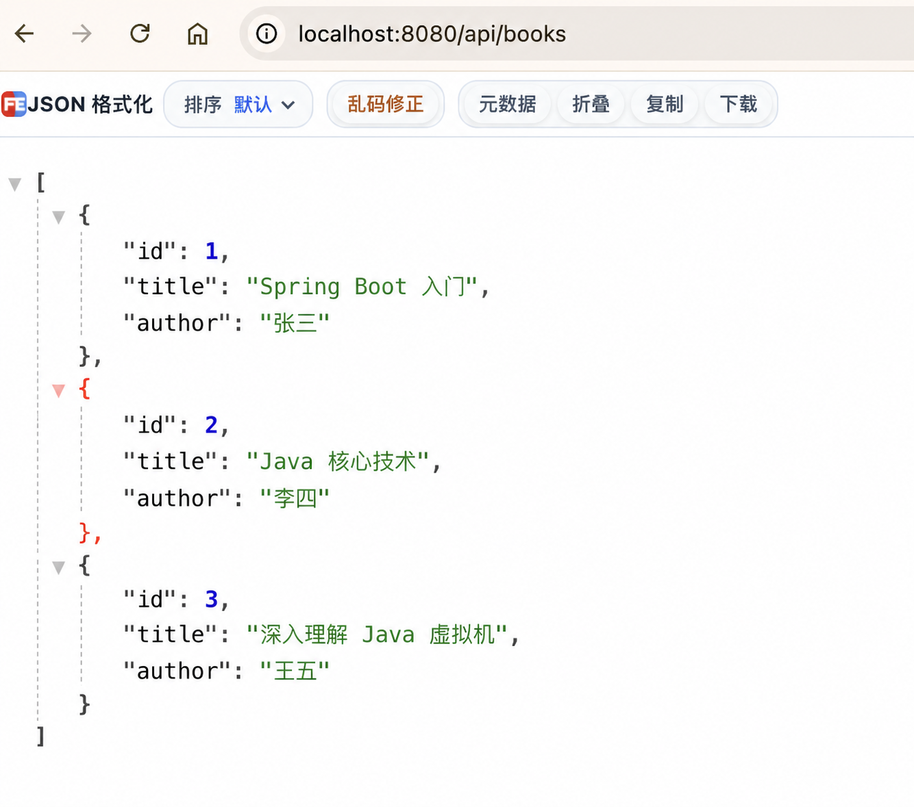
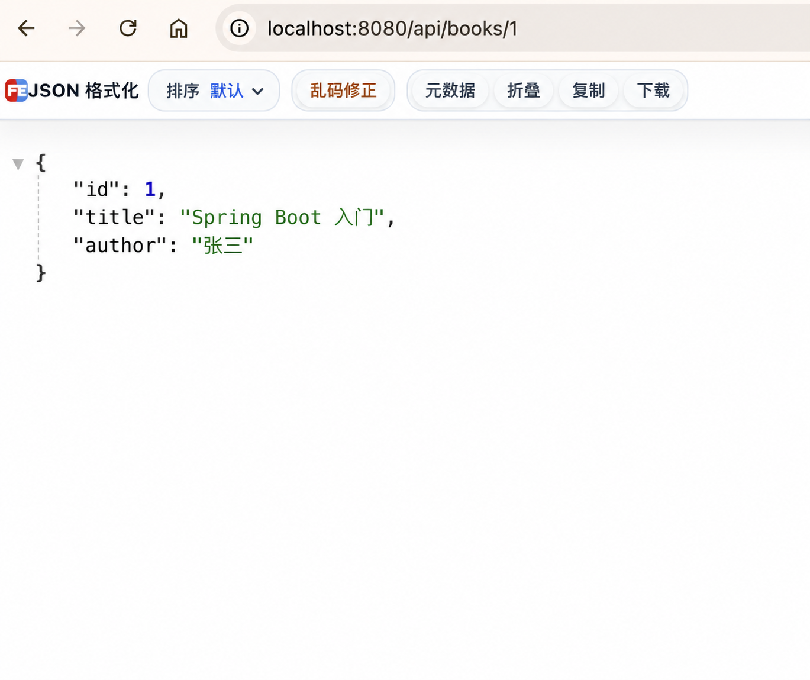

# 第 7 步：使用 List 查询全部图书

## 这一节要完成什么

上一节每次查询都会临时创建一本固定图书。本节改为：

1. 使用 Java `List` 在内存中保存三本图书。
2. 实现查询全部图书的接口。
3. 根据请求中的编号，从集合中找到对应图书。

本节仍然不使用数据库。程序停止后，集合中的数据会消失；重新启动时会再次创建三本初始图书。

## 1. 停止正在运行的项目

如果项目仍在运行，先在 IDEA 底部 Run 窗口点击红色方块。

修改 Java 代码后需要重新启动，旧进程不会自动使用新代码。

## 2. 打开 BookController

在 IDEA 左侧依次展开：

```text
src/main/java
└── com.example.bookapi
    └── controller
        └── BookController.java
```

本节会在这个 Controller 中保存和查询内存数据。

## 3. 导入 List 和 ArrayList

在 Spring 注解的 `import` 下方增加：

```java
import java.util.ArrayList;
import java.util.List;
```

它们都来自 JDK，不是 Spring 提供的类，因此不需要在 `pom.xml` 中增加依赖。

- `List`：一种接口，规定列表应该具有哪些操作。
- `ArrayList`：`List` 的常用实现，可以按照顺序保存多个对象。

代码中通常使用 `List` 声明变量，使用 `ArrayList` 创建对象：

```java
List<Book> books = new ArrayList<>();
```

这样以后可以更换其他 `List` 实现，而使用这个变量的代码不需要大改。

## 4. 创建图书集合

在 `BookController` 类中增加：

```java
private final List<Book> books = new ArrayList<>();
```

逐部分理解：

- `private`：只有 `BookController` 内部可以直接使用这个变量。
- `final`：变量 `books` 初始化后，不能再指向另一个 List 对象。
- `List<Book>`：这个列表只能保存 `Book` 对象。
- `books`：变量名。
- `new ArrayList<>()`：在内存中创建一个空列表。

`final` 并不表示列表内容不能变化。仍然可以调用 `books.add(...)` 增加图书；只是不能执行 `books = new ArrayList<>()` 让它指向另一个列表。

`<Book>` 称为泛型，它限制列表的元素类型。这样从列表取出数据时，Java 知道得到的是 `Book`。

## 5. 在构造方法中添加初始数据

继续增加 Controller 的构造方法：

```java
public BookController() {
    books.add(new Book(1L, "Spring Boot 入门", "张三"));
    books.add(new Book(2L, "Java 核心技术", "李四"));
    books.add(new Book(3L, "深入理解 Java 虚拟机", "王五"));
}
```

构造方法的特点：

- 方法名与类名 `BookController` 相同。
- 没有返回类型，不能写 `void`。
- 创建 `BookController` 对象时会自动执行一次。

应用启动时，Spring 扫描到 `@RestController`，会创建并管理一个 `BookController` 对象。创建过程中执行这个构造方法，将三本图书加入列表。

以第一行数据为例：

```java
books.add(new Book(1L, "Spring Boot 入门", "张三"));
```

执行顺序是：

```text
new Book(...) 创建一个 Book 对象
                  ↓
books.add(...) 把对象放入列表末尾
```

编号后面的 `L` 表示这是 `long` 类型数字，可以传给 `Long id`。

## 6. 实现查询全部图书

在按编号查询方法上方增加：

```java
@GetMapping
public List<Book> findAll() {
    return books;
}
```

逐行理解：

```java
@GetMapping
```

没有填写子路径，因此它只使用类上的统一前缀：

```text
GET /api/books
```

```java
public List<Book> findAll()
```

- 方法名 `findAll` 表示查询全部数据。
- 返回类型是 `List<Book>`，即返回多本图书。
- 方法不需要请求参数，所以括号中为空。

```java
return books;
```

把列表交给 Spring MVC。Jackson 会依次把列表中的每个 `Book` 转换成 JSON 对象，再把整个列表转换成 JSON 数组。

Java 对象和 JSON 的对应关系：

```text
Book                  → JSON 对象  { ... }
List<Book>            → JSON 数组  [ ... ]
List 中的每个 Book   → 数组中的每个 { ... }
```

## 7. 修改按编号查询

把上一节 `findById` 中直接创建图书的代码：

```java
return new Book(id, "Spring Boot 入门", "张三");
```

替换为：

```java
for (Book book : books) {
    if (id.equals(book.getId())) {
        return book;
    }
}
return null;
```

### for 循环

```java
for (Book book : books)
```

这是 Java 增强 `for` 循环，可以理解为：依次取出 `books` 中的每一本图书，并把当前图书暂时放到变量 `book` 中。

假设列表中有三本书，循环过程是：

```text
第 1 次：book 指向编号 1 的图书
第 2 次：book 指向编号 2 的图书
第 3 次：book 指向编号 3 的图书
```

### 判断编号

```java
if (id.equals(book.getId()))
```

- `book.getId()`：取得当前图书编号。
- `id.equals(...)`：判断请求编号和当前图书编号的值是否相等。
- `if`：条件为 `true` 时执行大括号中的代码。

`Long` 是对象类型，比较它的数值是否相等时使用 `equals`，不要使用 `==`。

### 找到后立即返回

```java
return book;
```

找到编号相同的图书后，立即结束方法并返回这本图书，后面的循环不再执行。

### 没有找到

```java
return null;
```

如果循环结束仍没有找到，就返回 `null`。当前阶段先用这种简单写法。它还不能正确表达“图书不存在”，后续学习异常处理时会把它改成 HTTP `404 Not Found`。

## 8. 修改后的完整 Controller

```java
package com.example.bookapi.controller;

import com.example.bookapi.model.Book;
import org.springframework.web.bind.annotation.GetMapping;
import org.springframework.web.bind.annotation.PathVariable;
import org.springframework.web.bind.annotation.RequestMapping;
import org.springframework.web.bind.annotation.RestController;

import java.util.ArrayList;
import java.util.List;

@RestController
@RequestMapping("/api/books")
public class BookController {

    private final List<Book> books = new ArrayList<>();

    public BookController() {
        books.add(new Book(1L, "Spring Boot 入门", "张三"));
        books.add(new Book(2L, "Java 核心技术", "李四"));
        books.add(new Book(3L, "深入理解 Java 虚拟机", "王五"));
    }

    @GetMapping
    public List<Book> findAll() {
        return books;
    }

    @GetMapping("/{id}")
    public Book findById(@PathVariable Long id) {
        for (Book book : books) {
            if (id.equals(book.getId())) {
                return book;
            }
        }
        return null;
    }
}
```

## 9. 启动项目

1. 打开 `BookApiApplication.java`。
2. 点击 `main` 左侧绿色三角形。
3. 选择 **Run 'BookApiApplication'**。
4. 等待日志出现 `Started BookApiApplication`。

如果刚才没有停止旧程序，可能看到 `Port 8080 was already in use`。先停止旧程序，再重新运行。

## 10. 验证查询全部图书

浏览器访问：

```text
http://localhost:8080/api/books
```

预期返回 JSON 数组：

```json
[
  {
    "id": 1,
    "title": "Spring Boot 入门",
    "author": "张三"
  },
  {
    "id": 2,
    "title": "Java 核心技术",
    "author": "李四"
  },
  {
    "id": 3,
    "title": "深入理解 Java 虚拟机",
    "author": "王五"
  }
]
```

验证成功后的页面如下：



## 11. 验证按编号查询

依次访问：

```text
http://localhost:8080/api/books/1
http://localhost:8080/api/books/2
http://localhost:8080/api/books/3
```

每个地址应该返回对应编号的图书，而不是像上一节一样只改变编号、书名和作者保持固定。

查询编号 1 的图书成功页面如下：



还可以访问一个不存在的编号：

```text
http://localhost:8080/api/books/999
```

当前会得到空响应。后续会将它改为明确的 404 错误响应。

## 12. 查询全部图书的执行过程

```text
浏览器发送 GET /api/books
            ↓
Tomcat 接收请求
            ↓
Spring MVC 找到 BookController.findAll()
            ↓
findAll() 返回 List<Book>
            ↓
Jackson 依次读取每个 Book 的 Getter
            ↓
Jackson 生成 JSON 数组
            ↓
浏览器显示三本图书
```

## 成功标准

- `/api/books` 返回包含三本图书的 JSON 数组。
- `/api/books/2` 返回《Java 核心技术》。
- 能说明 `List<Book>` 表示什么。
- 能说明构造方法什么时候执行。
- 能大致说明 `for` 循环如何查找图书。

## 常见问题

### List 或 ArrayList 显示红色

确认文件顶部存在：

```java
import java.util.ArrayList;
import java.util.List;
```

也可以把光标放在红色类名上，按 `Option + Enter`，让 IDEA 自动导入。

### 访问 /api/books/2 仍然返回第一本书

确认 `findById` 中已经删除原来的 `new Book(...)`，并使用 `for` 循环遍历 `books`。

### 修改代码后结果没有变化

确认已经停止旧程序并重新运行。当前项目还没有添加自动热更新功能。

### 提示 Unsupported class file major version

这通常表示 `target` 中残留了其他 Java 版本编译的文件。先确认 IDEA 的 Project SDK 和 Maven Runner 都是 Java 8，然后在项目根目录执行：

```bash
mvn clean test
```

`clean` 会删除 Maven 自动生成的 `target` 目录，随后 `test` 会使用当前 Java 版本重新编译并测试。`target` 只包含构建产物，删除它不会删除源码。
