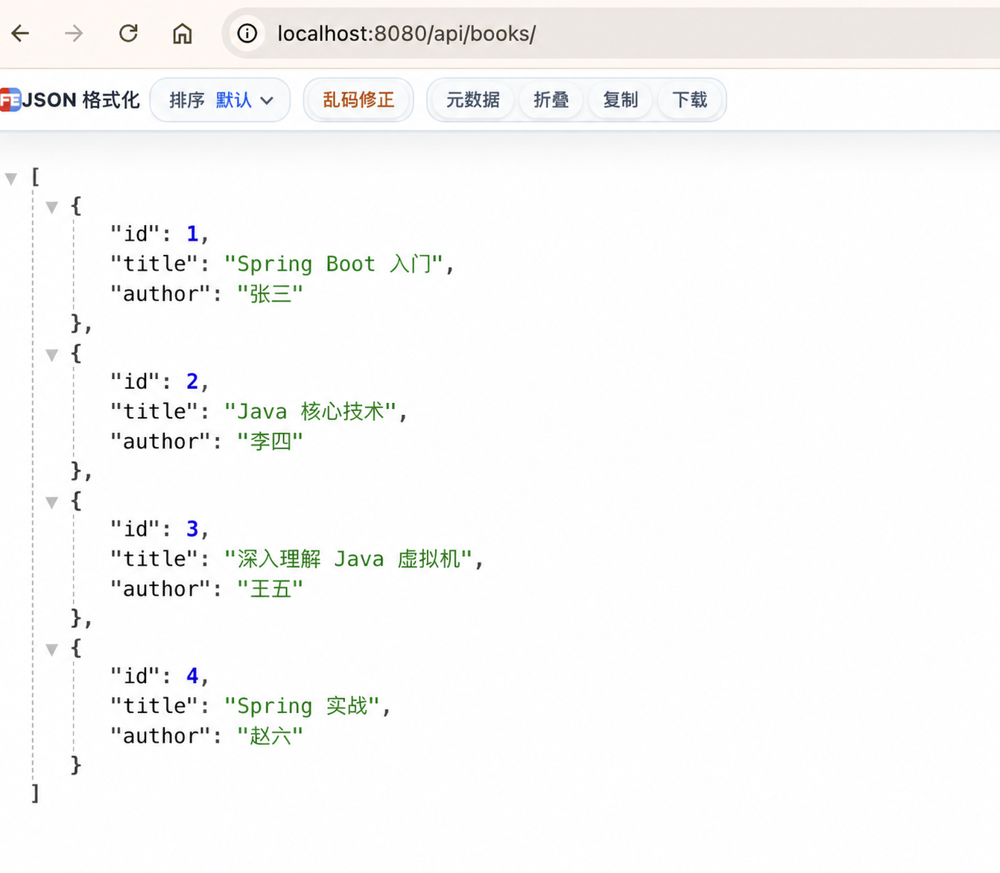

# 第 8 步：使用 POST 新增图书

## 这一节要完成什么

上一节只能读取程序中已有的图书。本节增加一个接口，让客户端发送 JSON，Spring Boot 把 JSON 转换成 `Book` 对象并保存到内存列表。

新增接口：

```text
POST /api/books
```

请求 JSON：

```json
{
  "title": "Spring 实战",
  "author": "赵六"
}
```

预期响应状态是 `201 Created`，响应内容是带有新编号的图书：

```json
{
  "id": 4,
  "title": "Spring 实战",
  "author": "赵六"
}
```

## 1. GET 和 POST 的区别

目前使用过两种 HTTP 请求方法：

| 请求方法 | 主要用途 | 当前示例 |
| --- | --- | --- |
| GET | 查询资源，不应该修改数据 | 查询全部或单本图书 |
| POST | 创建新资源 | 新增一本图书 |

在浏览器地址栏输入地址，默认发送的是 GET 请求。POST 请求还需要携带 JSON 请求体，因此不能只靠地址栏完成，需要使用 IDEA HTTP Client、curl 或 Postman 等工具。

## 2. 停止旧程序

如果项目仍在运行，先在 IDEA 底部 Run 窗口点击红色方块。

修改 Java 代码后必须重新启动，旧进程不会自动加载新代码。

## 3. 为 Book 增加无参数构造方法

打开：

```text
src/main/java/com/example/bookapi/model/Book.java
```

在三个成员变量之后增加：

```java
public Book() {
}
```

现在 `Book` 有两个构造方法：

```java
public Book() {
}

public Book(Long id, String title, String author) {
    this.id = id;
    this.title = title;
    this.author = author;
}
```

这称为构造方法重载：方法名相同，但参数列表不同。

- `new Book()`：调用无参数构造方法，先创建一个字段为空的对象。
- `new Book(1L, "书名", "作者")`：调用有参数构造方法，创建对象时直接填写字段。

收到 JSON 后，Jackson 需要创建 `Book` 对象。最容易理解的过程是：

```text
调用 new Book() 创建空对象
            ↓
读取 JSON 中的 title
            ↓
调用 setTitle(...)
            ↓
读取 JSON 中的 author
            ↓
调用 setAuthor(...)
```

因此，本节需要无参数构造方法和 Setter。

## 4. 导入新增接口需要的类型

打开：

```text
src/main/java/com/example/bookapi/controller/BookController.java
```

增加下面的 import：

```java
import org.springframework.http.HttpStatus;
import org.springframework.web.bind.annotation.PostMapping;
import org.springframework.web.bind.annotation.RequestBody;
import org.springframework.web.bind.annotation.ResponseStatus;
```

IDEA 通常会自动添加 import。也可以把光标放在红色类名上，按 `Option + Enter` 选择导入。

四个类型的用途：

- `HttpStatus`：表示 HTTP 状态码。
- `@PostMapping`：把 POST 请求映射到 Java 方法。
- `@RequestBody`：把请求体 JSON 转换成 Java 对象。
- `@ResponseStatus`：指定接口成功时返回的 HTTP 状态。

## 5. 增加下一个图书编号

在 `books` 成员变量下方增加：

```java
private long nextId = 4L;
```

当前初始数据的编号是 1、2、3，因此下一本图书从 4 开始。

- `private`：只允许 Controller 内部直接访问。
- `long`：Java 基本整数类型。
- `nextId`：保存下一本新书应该使用的编号。
- `4L`：用 `L` 表示 long 类型数字。

这个值保存在内存中。程序每次重启后都会重新变成 4。

## 6. 实现 create 方法

在 `findAll()` 和 `findById()` 之间增加：

```java
@PostMapping
@ResponseStatus(HttpStatus.CREATED)
public Book create(@RequestBody Book book) {
    book.setId(nextId);
    nextId = nextId + 1;
    books.add(book);
    return book;
}
```

下面逐行理解。

### @PostMapping

```java
@PostMapping
```

表示这个方法接收 POST 请求。因为没有填写子路径，它与类上的地址前缀组合后是：

```text
POST /api/books
```

同一个地址可以同时存在 GET 和 POST：

```text
GET  /api/books → findAll()
POST /api/books → create(...)
```

Spring 不只根据地址选择方法，还会判断 HTTP 请求方法。

### 返回 201 Created

```java
@ResponseStatus(HttpStatus.CREATED)
```

创建资源成功时，REST API 通常返回 HTTP `201 Created`。如果不写这个注解，默认会返回 `200 OK`。

### 接收请求体

```java
public Book create(@RequestBody Book book)
```

- 返回类型 `Book`：方法最后返回新增成功的图书。
- 方法名 `create`：表达创建资源。
- `@RequestBody`：让 Spring 使用 Jackson 读取请求体 JSON。
- `Book book`：JSON 转换完成后得到的 Java 对象。

客户端不需要提供 `id`，编号由服务器生成。

### 设置编号

```java
book.setId(nextId);
```

调用 Setter，把当前 `nextId` 保存到新图书的 `id` 字段。

### 编号递增

```java
nextId = nextId + 1;
```

假设当前是 4：

```text
计算右侧 nextId + 1，得到 5
                 ↓
把 5 保存回左侧 nextId
```

因此下一次新增图书会使用编号 5。

### 保存到列表

```java
books.add(book);
```

将新图书放入内存列表。只要应用不停止，后面的查询就能看到它。

### 返回新增结果

```java
return book;
```

把带有服务器编号的图书交给 Spring MVC，再由 Jackson 转成 JSON 响应。

## 7. 修改后的完整 BookController

```java
package com.example.bookapi.controller;

import com.example.bookapi.model.Book;
import org.springframework.http.HttpStatus;
import org.springframework.web.bind.annotation.GetMapping;
import org.springframework.web.bind.annotation.PathVariable;
import org.springframework.web.bind.annotation.PostMapping;
import org.springframework.web.bind.annotation.RequestBody;
import org.springframework.web.bind.annotation.RequestMapping;
import org.springframework.web.bind.annotation.ResponseStatus;
import org.springframework.web.bind.annotation.RestController;

import java.util.ArrayList;
import java.util.List;

@RestController
@RequestMapping("/api/books")
public class BookController {

    private final List<Book> books = new ArrayList<>();
    private long nextId = 4L;

    public BookController() {
        books.add(new Book(1L, "Spring Boot 入门", "张三"));
        books.add(new Book(2L, "Java 核心技术", "李四"));
        books.add(new Book(3L, "深入理解 Java 虚拟机", "王五"));
    }

    @GetMapping
    public List<Book> findAll() {
        return books;
    }

    @PostMapping
    @ResponseStatus(HttpStatus.CREATED)
    public Book create(@RequestBody Book book) {
        book.setId(nextId);
        nextId = nextId + 1;
        books.add(book);
        return book;
    }

    @GetMapping("/{id}")
    public Book findById(@PathVariable Long id) {
        for (Book book : books) {
            if (id.equals(book.getId())) {
                return book;
            }
        }
        return null;
    }
}
```

## 8. 使用 IDEA HTTP Client

> 当前学习环境的 IDEA HTTP Client 需要许可证，因此本课程实际操作统一使用下一节介绍的 `curl`。本节内容仅用于认识 `.http` 请求文件，不要求执行。

项目中已经提供：

```text
requests/book-api.http
```

在 IDEA 左侧双击打开这个文件，可以看到三段请求。

每段请求上方会出现绿色运行三角形。操作顺序：

1. 重新运行 `BookApiApplication`。
2. 打开 `requests/book-api.http`。
3. 找到“新增一本图书”请求。
4. 点击这段 POST 请求左侧的绿色三角形。
5. 选择 **Run**。
6. IDEA 会打开 Services 或 HTTP Client 响应窗口。

POST 请求内容：

```http
POST http://localhost:8080/api/books
Content-Type: application/json

{
  "title": "Spring 实战",
  "author": "赵六"
}
```

空行很重要：请求头和 JSON 请求体之间必须保留一个空行。

预期状态：

```text
201 Created
```

预期响应：

```json
{
  "id": 4,
  "title": "Spring 实战",
  "author": "赵六"
}
```

## 9. 使用 curl 发送 POST 请求（当前推荐方式）

如果文件上方出现下面的提示：

```text
激活 IDE 许可证以使用 HTTP 客户端
```

说明当前 IDEA 版本或许可证不包含 HTTP Client 功能。这不是 Java 代码错误，也不影响 Spring Boot 项目运行。无需点击“申请试用”，本课程统一使用 macOS 自带的 `curl` 完成验证。

保持 `BookApiApplication` 继续运行，然后点击 IDEA 底部的 **Terminal**。看到命令提示符后，复制并执行：

```bash
curl -i -X POST http://localhost:8080/api/books \
  -H 'Content-Type: application/json' \
  -d '{"title":"Spring 实战","author":"赵六"}'
```

参数含义：

- `-i`：显示响应状态和响应头。
- `-X POST`：使用 POST 请求。
- `-H`：添加 `Content-Type: application/json` 请求头。
- `-d`：指定要发送的 JSON 数据。
- 行末的 `\`：表示命令还没结束，下一行继续。

如果写成一行，命令是：

```bash
curl -i -X POST http://localhost:8080/api/books -H 'Content-Type: application/json' -d '{"title":"Spring 实战","author":"赵六"}'
```

粘贴命令后按回车。终端返回内容的第一行应该类似：

```text
HTTP/1.1 201
```

最后一行应该包含：

```json
{"id":4,"title":"Spring 实战","author":"赵六"}
```

JSON 显示在一行是正常的，不影响数据含义。

## 10. 查询新增结果

新增成功后，不要重启应用。浏览器访问：

```text
http://localhost:8080/api/books
```

返回数组中应该出现第四本图书。

再访问：

```text
http://localhost:8080/api/books/4
```

应该返回刚新增的《Spring 实战》。

如果新增后重启应用，内存列表会恢复为三本初始图书，编号也会重新从 4 开始。这正是内存数据与数据库数据的重要区别。

## 11. 一次新增请求的完整过程

```text
HTTP Client 发送 POST /api/books 和 JSON
                    ↓
Tomcat 接收请求
                    ↓
Spring MVC 匹配 BookController.create(...)
                    ↓
Jackson 调用 new Book() 创建空对象
                    ↓
Jackson 调用 Setter 写入 title 和 author
                    ↓
@RequestBody 把 Book 对象交给参数 book
                    ↓
create() 设置 id 并放入 books 列表
                    ↓
create() 返回 Book 对象
                    ↓
Jackson 把 Book 转成响应 JSON
                    ↓
Spring 返回 201 Created
```

## 成功标准

- POST 请求返回 `201 Created`。
- 响应图书编号是 4。
- 查询全部图书能看到新增的数据。
- `/api/books/4` 能查询到新增图书。
- 能说明 `@RequestBody` 的作用。
- 能说明为什么 `Book` 需要无参数构造方法。

## 本节验证结果

本节已经完成实际验证：

1. 使用 `curl` 发送 POST 请求。
2. 服务端返回 HTTP `201`。
3. 响应 JSON 中的新图书编号是 4。
4. 再次查询全部图书时，列表中包含刚刚新增的第 4 本图书。

验证截图：



## 常见问题

### 返回 405 Method Not Allowed

说明地址存在，但请求方法不匹配。确认发送的是 POST，而不是在浏览器地址栏直接访问。

### 返回 415 Unsupported Media Type

确认请求中包含：

```http
Content-Type: application/json
```

### 返回 400 Bad Request

检查 JSON：

- 属性名和字符串必须使用英文双引号。
- 两个属性之间需要逗号。
- 最后一个属性后面不要多写逗号。
- JSON 前面要保留请求头与请求体之间的空行。

### 新增后查询不到

确认 POST 返回了 201，并且新增后没有停止或重新启动项目。当前数据只保存在运行进程的内存中。

### 每次新增都从编号 4 开始

如果每次请求前都重启应用，`nextId` 会重新初始化为 4。保持同一个应用进程运行，连续发送 POST，编号会依次变成 4、5、6。
