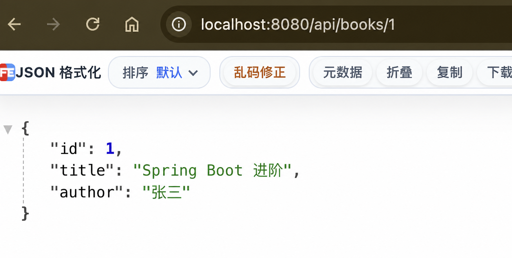

# 第 9 步：使用 PUT 修改图书

## 这一节要完成什么

前面已经能够查询和新增图书。本节增加修改接口，让客户端根据图书编号更新已有图书的书名和作者。

新增接口：

```text
PUT /api/books/{id}
```

本次使用编号 1 进行验证：

```text
PUT /api/books/1
```

请求 JSON：

```json
{
  "title": "Spring Boot 进阶",
  "author": "张三"
}
```

预期响应：

```json
{
  "id": 1,
  "title": "Spring Boot 进阶",
  "author": "张三"
}
```

## 1. 为什么修改使用 PUT

目前项目使用了三种 HTTP 请求方法：

| 请求方法 | 作用 | 当前接口 |
| --- | --- | --- |
| GET | 查询数据 | 查询全部图书、查询单本图书 |
| POST | 创建新数据 | 新增图书 |
| PUT | 更新指定数据 | 修改指定编号的图书 |

PUT 请求需要明确指出修改哪一本图书，因此地址中包含图书编号：

```text
/api/books/1
           ↑
       要修改的编号
```

请求体 JSON 提供修改后的书名和作者。

本节把 PUT 理解为“使用请求体中的新内容更新指定图书”。以后学习更完整的 REST API 时，还会接触只更新部分字段的 PATCH 请求。

## 2. 停止旧程序

修改 Java 代码前，如果项目仍在运行，请在 IDEA 底部 Run 窗口点击红色方块停止程序。

代码修改完成后必须重新启动。正在运行的旧进程不会自动拥有新增加的 PUT 接口。

## 3. 导入 PutMapping

打开：

```text
src/main/java/com/example/bookapi/controller/BookController.java
```

在文件上方增加：

```java
import org.springframework.web.bind.annotation.PutMapping;
```

`PutMapping` 是 Spring MVC 提供的注解类型。导入后，当前 Java 文件才能使用 `@PutMapping`。

如果在 IDEA 中手动输入 `@PutMapping` 后显示红色：

1. 把光标放在 `PutMapping` 上。
2. 按 `Option + Enter`。
3. 选择导入 `org.springframework.web.bind.annotation.PutMapping`。

## 4. 编写 update 方法

在 `create()` 方法下面增加：

```java
@PutMapping("/{id}")
public Book update(@PathVariable Long id, @RequestBody Book updatedBook) {
    for (Book book : books) {
        if (id.equals(book.getId())) {
            book.setTitle(updatedBook.getTitle());
            book.setAuthor(updatedBook.getAuthor());
            return book;
        }
    }
    return null;
}
```

下面逐行理解这段代码。

### 映射 PUT 请求

```java
@PutMapping("/{id}")
```

`@PutMapping` 表示这个方法只处理 PUT 请求。

类上已经有：

```java
@RequestMapping("/api/books")
```

类地址和方法地址组合后得到：

```text
PUT /api/books/{id}
```

`{id}` 是路径变量。访问 `/api/books/1` 时，`id` 的值就是 1。

### 方法声明和两个参数

```java
public Book update(@PathVariable Long id, @RequestBody Book updatedBook)
```

- `public`：Spring 可以调用这个方法。
- `Book`：方法执行成功后返回修改过的图书对象。
- `update`：方法名，表达“修改图书”。
- `@PathVariable Long id`：读取 URL 中的编号。
- `@RequestBody Book updatedBook`：把请求 JSON 转换成一个新的 `Book` 对象。

这里同时出现了两个 Book 对象：

```text
updatedBook → 客户端发来的新内容
book        → books 列表中原来保存的对象
```

名字不同是为了帮助区分它们的用途。

### 遍历全部图书

```java
for (Book book : books) {
```

从 `books` 列表中依次取出每一本图书，并把当前取出的对象命名为 `book`。

如果列表中有 3 本书，这个循环最多执行 3 次。

### 比较图书编号

```java
if (id.equals(book.getId())) {
```

- `id`：URL 中传入的编号。
- `book.getId()`：当前图书的编号。
- `equals()`：判断两个 Long 对象表示的数值是否相同。

找到相同编号后，才进入大括号修改数据。

### 修改书名

```java
book.setTitle(updatedBook.getTitle());
```

这行代码可以分成两步理解：

```text
updatedBook.getTitle()
        ↓
从请求对象读取新书名
        ↓
book.setTitle(...)
        ↓
把新书名写入列表中的原图书
```

### 修改作者

```java
book.setAuthor(updatedBook.getAuthor());
```

读取请求对象中的新作者，再通过 Setter 写入原图书对象。

本节不会修改图书编号。编号来自 URL，并继续使用原图书的编号。即使客户端在 JSON 中额外发送 `id`，当前代码也不会使用这个 JSON 编号。

### 返回修改后的图书

```java
return book;
```

找到并修改完成后立即返回当前对象，同时结束循环和方法。Spring 再使用 Jackson 把对象转换成 JSON。

### 没有找到图书

```java
return null;
```

如果循环结束仍没有相同编号，当前入门版本返回空内容。这样可以先专注理解“查找并修改”的代码。

规范的 API 应该在图书不存在时返回 HTTP `404 Not Found`。后面的“统一异常处理”课程会专门改进这里以及 `findById()` 的处理方式。

## 5. 修改后的完整 BookController

```java
package com.example.bookapi.controller;

import com.example.bookapi.model.Book;
import org.springframework.http.HttpStatus;
import org.springframework.web.bind.annotation.GetMapping;
import org.springframework.web.bind.annotation.PathVariable;
import org.springframework.web.bind.annotation.PostMapping;
import org.springframework.web.bind.annotation.PutMapping;
import org.springframework.web.bind.annotation.RequestBody;
import org.springframework.web.bind.annotation.RequestMapping;
import org.springframework.web.bind.annotation.ResponseStatus;
import org.springframework.web.bind.annotation.RestController;

import java.util.ArrayList;
import java.util.List;

@RestController
@RequestMapping("/api/books")
public class BookController {

    private final List<Book> books = new ArrayList<>();
    private long nextId = 4L;

    public BookController() {
        books.add(new Book(1L, "Spring Boot 入门", "张三"));
        books.add(new Book(2L, "Java 核心技术", "李四"));
        books.add(new Book(3L, "深入理解 Java 虚拟机", "王五"));
    }

    @GetMapping
    public List<Book> findAll() {
        return books;
    }

    @PostMapping
    @ResponseStatus(HttpStatus.CREATED)
    public Book create(@RequestBody Book book) {
        book.setId(nextId);
        nextId = nextId + 1;
        books.add(book);
        return book;
    }

    @PutMapping("/{id}")
    public Book update(@PathVariable Long id, @RequestBody Book updatedBook) {
        for (Book book : books) {
            if (id.equals(book.getId())) {
                book.setTitle(updatedBook.getTitle());
                book.setAuthor(updatedBook.getAuthor());
                return book;
            }
        }
        return null;
    }

    @GetMapping("/{id}")
    public Book findById(@PathVariable Long id) {
        for (Book book : books) {
            if (id.equals(book.getId())) {
                return book;
            }
        }
        return null;
    }
}
```

## 6. 启动项目

1. 打开 `BookApiApplication.java`。
2. 点击 `main` 方法左侧的绿色三角形。
3. 选择 **Run 'BookApiApplication'**。
4. 等待控制台出现 `Started BookApiApplication`。

启动时，构造方法会重新创建 3 本初始图书。因此本节直接修改一直存在的 1 号图书。

## 7. 使用 curl 发送 PUT 请求

由于当前 IDEA 的 HTTP Client 需要许可证，本节直接使用 macOS 自带的 `curl`。

保持 Spring Boot 正在运行，打开 IDEA 底部 **Terminal**，复制下面整行命令并按回车：

```bash
curl -i -X PUT http://localhost:8080/api/books/1 -H 'Content-Type: application/json' -d '{"title":"Spring Boot 进阶","author":"张三"}'
```

参数含义：

- `curl`：发送 HTTP 请求的命令行工具。
- `-i`：显示响应状态和响应头。
- `-X PUT`：明确使用 PUT 请求。
- `http://localhost:8080/api/books/1`：修改编号为 1 的图书。
- `-H 'Content-Type: application/json'`：告诉服务器请求体是 JSON。
- `-d '...'`：指定要发送的新书名和作者。

预期响应状态：

```text
HTTP/1.1 200
```

预期响应 JSON：

```json
{"id":1,"title":"Spring Boot 进阶","author":"张三"}
```

响应 JSON 显示在一行是正常的。

## 8. 查询并确认修改结果

发送 PUT 请求后不要重启程序，在浏览器访问：

```text
http://localhost:8080/api/books/1
```

应该看到：

```json
{
  "id": 1,
  "title": "Spring Boot 进阶",
  "author": "张三"
}
```

还可以访问全部图书：

```text
http://localhost:8080/api/books
```

第 1 本图书应该已经更新，第 2、3 本图书保持不变。

如果修改后重启项目，书名会恢复为“Spring Boot 入门”。这是因为当前数据只保存在内存中，还没有写入数据库。

## 9. 一次修改请求的完整运行过程

```text
curl 发送 PUT /api/books/1 和 JSON
                  ↓
Tomcat 接收 HTTP 请求
                  ↓
Spring MVC 根据 PUT 和地址匹配 update(...)
                  ↓
@PathVariable 把地址中的 1 转换成 Long id
                  ↓
Jackson 调用 new Book() 创建请求对象
                  ↓
Jackson 通过 Setter 写入新 title 和 author
                  ↓
@RequestBody 把请求对象交给 updatedBook
                  ↓
for 循环在 books 中查找 id=1 的原对象
                  ↓
调用 Setter 修改原对象的 title 和 author
                  ↓
update() 返回修改后的 Book
                  ↓
Jackson 把 Book 转换成响应 JSON
                  ↓
Spring 返回 HTTP 200
```

## 成功标准

- PUT 请求返回 HTTP `200`。
- 响应中的图书编号仍然是 1。
- 响应中的书名变成“Spring Boot 进阶”。
- 再次 GET `/api/books/1` 能看到修改后的数据。
- 能说出 `@PutMapping` 的作用。
- 能区分 `book` 和 `updatedBook` 两个对象。

## 本节验证结果

本节已经完成实际验证：

1. 使用 `curl` 向 `/api/books/1` 发送 PUT 请求。
2. 服务端返回 HTTP `200`。
3. 响应中的图书编号仍然是 1。
4. 响应中的书名已经变成“Spring Boot 进阶”。
5. 再次通过 GET 查询 1 号图书，仍然能够看到修改后的内容。

验证截图：



## 常见问题

### 返回 405 Method Not Allowed

确认已经停止旧程序并重新启动，也要确认命令中包含 `-X PUT`。

### 返回 415 Unsupported Media Type

确认命令中包含：

```text
-H 'Content-Type: application/json'
```

### 返回 400 Bad Request

检查 JSON 中的属性名和字符串是否使用英文双引号，并确认两个属性之间有逗号。

### 返回的书名没有变化

确认请求地址是 `/api/books/1`，并且请求 JSON 中使用属性名 `title`，不是其他拼写。

### 浏览器查询时又变回原书名

确认 PUT 请求后没有停止或重新启动项目。当前数据只存在于运行中的内存列表。

### 修改不存在的编号得到空响应

这是当前入门实现的临时行为。后续异常处理课程会让它返回明确的 HTTP `404 Not Found` 和错误 JSON。
