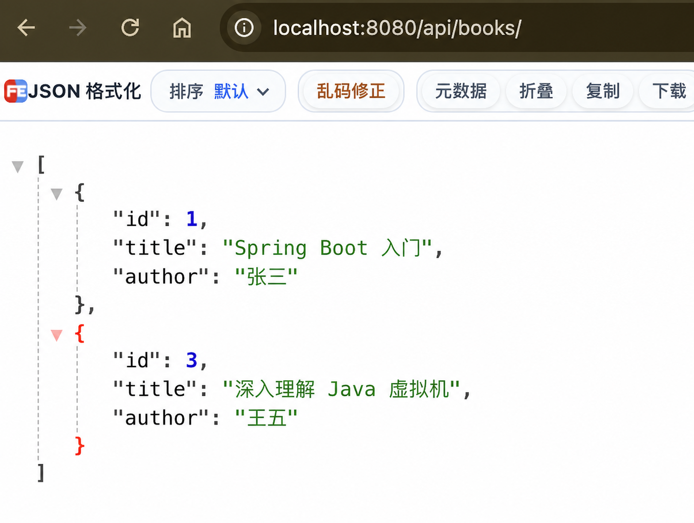

# 第 10 步：使用 DELETE 删除图书

## 这一节要完成什么

前面已经实现图书的新增、查询和修改。本节增加删除接口，根据 URL 中的编号从内存列表中移除一本图书。

新增接口：

```text
DELETE /api/books/{id}
```

本次删除编号为 2 的图书：

```text
DELETE /api/books/2
```

删除成功后，服务器返回：

```text
HTTP 204 No Content
```

然后再次查询全部图书，列表中应该只剩编号 1 和 3。

## 1. 什么是 DELETE 请求

目前项目已经使用四种常见 HTTP 请求方法：

| 请求方法 | 作用 | 当前示例 |
| --- | --- | --- |
| GET | 查询数据 | 查询全部或指定图书 |
| POST | 新增数据 | 新增一本图书 |
| PUT | 修改数据 | 修改指定编号的图书 |
| DELETE | 删除数据 | 删除指定编号的图书 |

DELETE 请求通过地址指出要删除的资源：

```text
/api/books/2
           ↑
       要删除的编号
```

本节不需要发送 JSON 请求体，因为图书编号已经足够确定删除目标。

## 2. 为什么选择删除编号 2

项目每次启动都会创建三本初始图书：

| id | title | author |
| --- | --- | --- |
| 1 | Spring Boot 入门 | 张三 |
| 2 | Java 核心技术 | 李四 |
| 3 | 深入理解 Java 虚拟机 | 王五 |

编号 2 在每次重启后都存在，所以验证步骤可以稳定重现，不依赖之前是否发送过 POST 或 PUT 请求。

删除编号 2 后，剩余编号是 1 和 3。编号 3 不会自动变成 2，因为 `id` 是资源的固定身份，不是当前列表位置。

## 3. 停止旧程序

如果项目正在运行，在 IDEA 底部 Run 窗口点击红色方块停止程序。

修改 Java 代码后必须重新启动，否则正在运行的旧程序中没有新增加的 DELETE 接口。

## 4. 导入 DeleteMapping

打开：

```text
src/main/java/com/example/bookapi/controller/BookController.java
```

增加 import：

```java
import org.springframework.web.bind.annotation.DeleteMapping;
```

`DeleteMapping` 是 Spring MVC 提供的注解类型。它用于把 HTTP DELETE 请求映射到 Java 方法。

如果 IDEA 中 `DeleteMapping` 显示红色：

1. 把光标放在红色名称上。
2. 按 `Option + Enter`。
3. 选择导入 `org.springframework.web.bind.annotation.DeleteMapping`。

## 5. 编写 delete 方法

在 `update()` 方法下面增加：

```java
@DeleteMapping("/{id}")
@ResponseStatus(HttpStatus.NO_CONTENT)
public void delete(@PathVariable Long id) {
    for (int index = 0; index < books.size(); index++) {
        Book book = books.get(index);
        if (id.equals(book.getId())) {
            books.remove(index);
            return;
        }
    }
}
```

下面逐行理解。

### 映射 DELETE 请求

```java
@DeleteMapping("/{id}")
```

类上的地址是：

```java
@RequestMapping("/api/books")
```

与方法地址组合后得到：

```text
DELETE /api/books/{id}
```

访问 `/api/books/2` 时，`{id}` 的值就是 2。

### 返回 204 No Content

```java
@ResponseStatus(HttpStatus.NO_CONTENT)
```

这个注解指定方法成功执行后返回 HTTP `204 No Content`。

- `HttpStatus`：Spring 提供的 HTTP 状态枚举。
- `NO_CONTENT`：表示请求处理成功，但响应没有正文。
- `204`：`NO_CONTENT` 对应的数字状态码。

删除成功后不需要把已经删除的对象再返回给客户端，因此 204 很适合这个接口。

### 方法声明

```java
public void delete(@PathVariable Long id)
```

- `public`：Spring 可以调用这个方法。
- `void`：方法不返回 Java 对象。
- `delete`：方法名，表达删除操作。
- `@PathVariable Long id`：读取 URL 中的图书编号。

`void` 与 204 相互对应：Java 方法没有返回对象，HTTP 响应也没有 JSON 正文。

### 使用索引遍历列表

```java
for (int index = 0; index < books.size(); index++) {
```

这是普通 `for` 循环：

- `int index = 0`：从列表第 0 个位置开始。
- `index < books.size()`：索引必须小于列表元素数量。
- `index++`：每轮循环结束后，索引增加 1。

Java 的 List 索引从 0 开始：

```text
列表索引：  0    1    2
图书编号：  1    2    3
```

索引是列表中的位置，图书 `id` 是业务编号，两者不是同一个概念。

### 根据索引取得图书

```java
Book book = books.get(index);
```

`books.get(index)` 取得当前位置的图书对象，并保存到变量 `book`。

第一次循环取得索引 0 的图书，第二次循环取得索引 1 的图书，以此类推。

### 比较编号

```java
if (id.equals(book.getId())) {
```

将 URL 中的目标编号与当前图书的编号比较。数值相同，说明找到了要删除的图书。

### 删除当前位置

```java
books.remove(index);
```

`remove(index)` 从列表中移除指定索引位置的元素。

例如删除编号 2 时，它位于索引 1：

```text
删除前：[id=1, id=2, id=3]
                    ↑
                 index=1

删除后：[id=1, id=3]
```

删除后，编号 3 的列表索引会从 2 变成 1，但它的业务编号仍然是 3。

### 删除后立即结束方法

```java
return;
```

这里的 `return` 没有返回值，只表示立即结束 `delete()` 方法。

找到并删除目标后，不应该继续遍历已经发生变化的列表。立即结束也能避免遍历过程中修改集合产生问题。

### 没有找到编号时会怎样

如果循环完成仍没有找到目标，方法会自然执行结束，并返回 204。

DELETE 通常应该具有幂等性：对同一个地址重复删除，最终状态都相同——目标资源不存在。当前入门实现因此对不存在的编号也返回 204。

后面的异常处理课程会继续讨论不同项目为什么可能选择返回 404，以及如何统一接口错误格式。

## 6. 为什么不使用增强 for 直接删除

查询时使用过：

```java
for (Book book : books) {
```

这种写法适合读取元素，但在遍历过程中直接通过 `books.remove(...)` 修改列表，容易产生 `ConcurrentModificationException`。

本节使用普通索引循环：

```java
for (int index = 0; index < books.size(); index++)
```

找到位置后按索引删除，并立即 `return`，逻辑更明确。

## 7. 修改后的完整 BookController

```java
package com.example.bookapi.controller;

import com.example.bookapi.model.Book;
import org.springframework.http.HttpStatus;
import org.springframework.web.bind.annotation.DeleteMapping;
import org.springframework.web.bind.annotation.GetMapping;
import org.springframework.web.bind.annotation.PathVariable;
import org.springframework.web.bind.annotation.PostMapping;
import org.springframework.web.bind.annotation.PutMapping;
import org.springframework.web.bind.annotation.RequestBody;
import org.springframework.web.bind.annotation.RequestMapping;
import org.springframework.web.bind.annotation.ResponseStatus;
import org.springframework.web.bind.annotation.RestController;

import java.util.ArrayList;
import java.util.List;

@RestController
@RequestMapping("/api/books")
public class BookController {

    private final List<Book> books = new ArrayList<>();
    private long nextId = 4L;

    public BookController() {
        books.add(new Book(1L, "Spring Boot 入门", "张三"));
        books.add(new Book(2L, "Java 核心技术", "李四"));
        books.add(new Book(3L, "深入理解 Java 虚拟机", "王五"));
    }

    @GetMapping
    public List<Book> findAll() {
        return books;
    }

    @PostMapping
    @ResponseStatus(HttpStatus.CREATED)
    public Book create(@RequestBody Book book) {
        book.setId(nextId);
        nextId = nextId + 1;
        books.add(book);
        return book;
    }

    @PutMapping("/{id}")
    public Book update(@PathVariable Long id, @RequestBody Book updatedBook) {
        for (Book book : books) {
            if (id.equals(book.getId())) {
                book.setTitle(updatedBook.getTitle());
                book.setAuthor(updatedBook.getAuthor());
                return book;
            }
        }
        return null;
    }

    @DeleteMapping("/{id}")
    @ResponseStatus(HttpStatus.NO_CONTENT)
    public void delete(@PathVariable Long id) {
        for (int index = 0; index < books.size(); index++) {
            Book book = books.get(index);
            if (id.equals(book.getId())) {
                books.remove(index);
                return;
            }
        }
    }

    @GetMapping("/{id}")
    public Book findById(@PathVariable Long id) {
        for (Book book : books) {
            if (id.equals(book.getId())) {
                return book;
            }
        }
        return null;
    }
}
```

## 8. 启动项目

1. 打开 `BookApiApplication.java`。
2. 点击 `main` 左侧的绿色三角形。
3. 选择 **Run 'BookApiApplication'**。
4. 等待控制台出现 `Started BookApiApplication`。

项目启动后先不要发送其他删除请求，确保编号 2 的初始图书仍然存在。

## 9. 使用 curl 删除图书

打开 IDEA 底部 **Terminal**，执行：

```bash
curl -i -X DELETE http://localhost:8080/api/books/2
```

参数含义：

- `-i`：显示响应状态和响应头。
- `-X DELETE`：指定请求方法是 DELETE。
- 地址末尾的 `2`：要删除的图书编号。

预期响应：

```text
HTTP/1.1 204
```

状态行后面没有 JSON 是正常的。`204 No Content` 本来就表示响应没有正文。

## 10. 查询并确认删除结果

发送 DELETE 后不要重启程序，在浏览器访问：

```text
http://localhost:8080/api/books
```

应该看到：

```json
[
  {
    "id": 1,
    "title": "Spring Boot 入门",
    "author": "张三"
  },
  {
    "id": 3,
    "title": "深入理解 Java 虚拟机",
    "author": "王五"
  }
]
```

重点观察：

- 编号 2 的图书已经消失。
- 编号 1 和 3 的内容没有变化。
- 编号 3 没有因为前一本书被删除而变成 2。

如果删除后重启程序，构造方法会重新创建三本初始图书，因此编号 2 会再次出现。这说明数据目前仍然只保存在内存中。

## 11. 一次删除请求的完整运行过程

```text
curl 发送 DELETE /api/books/2
                 ↓
Tomcat 接收 HTTP 请求
                 ↓
Spring MVC 根据 DELETE 和地址匹配 delete(...)
                 ↓
@PathVariable 把地址中的 2 转换成 Long id
                 ↓
for 循环按索引遍历 books 列表
                 ↓
books.get(index) 取得当前图书
                 ↓
比较目标 id 与当前图书 id
                 ↓
找到 id=2，调用 books.remove(index)
                 ↓
return 立即结束 delete() 方法
                 ↓
@ResponseStatus 指定 HTTP 204
                 ↓
客户端收到 204，没有 JSON 正文
```

## 12. 当前已经完成内存版 CRUD

CRUD 是四个英文单词的首字母：

| 缩写 | 英文 | 中文 | 当前接口 |
| --- | --- | --- | --- |
| C | Create | 新增 | POST `/api/books` |
| R | Read | 查询 | GET `/api/books`、GET `/api/books/{id}` |
| U | Update | 修改 | PUT `/api/books/{id}` |
| D | Delete | 删除 | DELETE `/api/books/{id}` |

完成本节后，项目已经拥有最基础的内存版增删改查。

目前所有逻辑都放在 Controller，数据也只存在 ArrayList 中。后续将学习 Controller、Service、Repository 分层，让每一层负责不同工作，再把内存数据替换成数据库数据。

## 成功标准

- DELETE 请求返回 HTTP `204`。
- 204 响应没有 JSON 正文。
- 再次查询全部图书时，只剩编号 1 和 3。
- 能说明图书 id 和 List 索引的区别。
- 能说明为什么删除后立即执行 `return`。
- 能说出 CRUD 四个字母分别代表什么。

## 本节验证结果

本节已经完成实际验证：

1. 使用 `curl` 向 `/api/books/2` 发送 DELETE 请求。
2. 服务端返回 HTTP `204`，没有 JSON 响应正文。
3. 再次查询全部图书时，编号 2 已经消失。
4. 列表中保留编号 1 和 3，证明删除操作不会重新排列业务编号。

验证截图：



## 常见问题

### 返回 405 Method Not Allowed

确认修改代码后已经重新启动程序，并确认命令中包含 `-X DELETE`。

### curl 没有显示 JSON

先查看状态是否为 `HTTP/1.1 204`。如果是 204，没有 JSON 正是正确结果。

### 查询时编号 2 仍然存在

确认 DELETE 请求返回 204，并且删除后没有重启应用。还要确认查询的地址是 `/api/books`。

### 删除后为什么只剩 1 和 3

图书编号是资源身份，不是列表中的连续排名。删除编号 2 不应该修改其他图书的编号。

### 连续执行两次 DELETE 都返回 204

这是当前实现的正常行为。第一次删除目标，第二次发现目标已经不存在；两次请求结束后的最终状态完全相同。

### 重启后被删除的图书又出现了

当前数据存放在内存中的 ArrayList。应用停止后内存数据消失，重新启动时构造方法又会创建三本初始图书。使用数据库后才能让删除结果持久保存。
