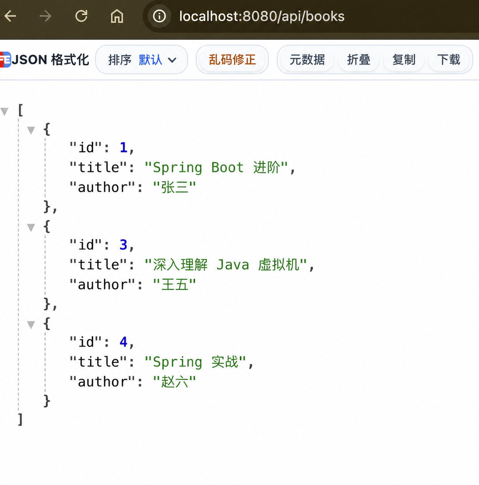

# 第 11 步：Controller、Service、Repository 分层

## 这一节要完成什么

目前图书管理 API 已经实现完整的内存版增删改查，但是所有逻辑都写在 `BookController` 中：

- 保存 `books` 列表
- 创建初始数据
- 生成新编号
- 查找图书
- 修改图书
- 删除图书
- 接收 HTTP 请求

代码较少时还能阅读，功能增加后 Controller 会越来越长。本节把代码拆成三个层次：

```text
Controller → Service → Repository
```

接口地址和请求方式不会变化。本节改变的是代码内部结构，而不是客户端使用方式。

## 1. 三层分别负责什么

| 层 | 当前类 | 主要职责 |
| --- | --- | --- |
| Controller | `BookController` | 接收 HTTP 请求、读取参数、决定 HTTP 状态、返回响应 |
| Service | `BookService` | 组织业务步骤，例如先查找图书再修改字段 |
| Repository | `BookRepository` | 保存、查询和删除数据 |

可以把三层理解成图书馆中的分工：

```text
读者提出需求
    ↓
前台接待（Controller）记录要办理什么
    ↓
业务人员（Service）判断应该执行哪些步骤
    ↓
书库管理员（Repository）真正查找或保存图书
```

分层不是为了让文件变多，而是让每个类的职责清楚。

## 2. 分层前后对比

分层前：

```text
HTTP 请求
    ↓
BookController
    ├── HTTP 映射
    ├── 业务逻辑
    └── List 数据
```

分层后：

```text
HTTP 请求
    ↓
BookController
    ↓
BookService
    ↓
BookRepository
    ↓
List<Book>
```

后面接入数据库时，主要替换 Repository 的数据访问方式，Controller 不需要关心数据来自 ArrayList、H2 还是 MySQL。

## 3. 停止旧程序

如果项目仍在运行，请在 IDEA 底部 Run 窗口点击红色方块停止程序。

本节会新增 Spring 管理的类并修改构造方法，完成后必须重新启动应用。

## 4. 在 IDEA 中创建 repository 包

1. 在左侧 Project 窗口展开 `src/main/java`。
2. 展开 `com.example.bookapi`。
3. 右键 `com.example.bookapi`。
4. 选择 **New → Package**。
5. 输入 `repository`。
6. 按回车。

完整包名会是：

```text
com.example.bookapi.repository
```

包可以帮助我们按照职责组织 Java 类。

## 5. 创建 BookRepository

1. 右键刚创建的 `repository` 包。
2. 选择 **New → Java Class**。
3. 输入 `BookRepository`。
4. 按回车。

完整代码：

```java
package com.example.bookapi.repository;

import com.example.bookapi.model.Book;
import org.springframework.stereotype.Repository;

import java.util.ArrayList;
import java.util.List;

@Repository
public class BookRepository {

    private final List<Book> books = new ArrayList<>();
    private long nextId = 4L;

    public BookRepository() {
        books.add(new Book(1L, "Spring Boot 入门", "张三"));
        books.add(new Book(2L, "Java 核心技术", "李四"));
        books.add(new Book(3L, "深入理解 Java 虚拟机", "王五"));
    }

    public List<Book> findAll() {
        return books;
    }

    public Book findById(Long id) {
        for (Book book : books) {
            if (id.equals(book.getId())) {
                return book;
            }
        }
        return null;
    }

    public Book save(Book book) {
        book.setId(nextId);
        nextId = nextId + 1;
        books.add(book);
        return book;
    }

    public void deleteById(Long id) {
        for (int index = 0; index < books.size(); index++) {
            Book book = books.get(index);
            if (id.equals(book.getId())) {
                books.remove(index);
                return;
            }
        }
    }
}
```

### @Repository

```java
@Repository
```

这个注解有两个重要含义：

1. 告诉阅读代码的人：这个类负责数据访问。
2. 告诉 Spring：启动时创建并管理一个 `BookRepository` 对象。

由 Spring 创建和管理的对象通常称为 Bean。

当前 Repository 使用 ArrayList，以后会替换成数据库。虽然目前没有真正连接数据库，使用 `@Repository` 仍然可以表达这个类的职责。

### 数据移动到 Repository

```java
private final List<Book> books = new ArrayList<>();
private long nextId = 4L;
```

这两个成员变量原来在 Controller 中，现在移动到 Repository，因为它们都属于数据存储细节。

初始数据构造方法也一起移动：

```java
public BookRepository() {
    books.add(...);
}
```

Spring 创建 Repository 对象时会调用这个构造方法，因此项目启动后仍然拥有三本初始图书。

### findAll 和 findById

```java
public List<Book> findAll()
public Book findById(Long id)
```

Repository 提供查询全部和根据编号查询的方法。原来的查找循环不再属于 Controller。

### save

```java
public Book save(Book book)
```

`save` 表示保存数据。当前实现负责：

1. 设置新编号。
2. 让下一个编号递增。
3. 把图书放入列表。
4. 返回保存后的图书。

使用 `save` 这个名字，是因为以后 Spring Data JPA 的 Repository 也会提供同名方法。

### deleteById

```java
public void deleteById(Long id)
```

方法名表达“根据编号删除”。索引循环和删除代码从 Controller 移到了这里。

## 6. 在 IDEA 中创建 service 包

1. 右键 `com.example.bookapi`。
2. 选择 **New → Package**。
3. 输入 `service`。
4. 按回车。

完整包名：

```text
com.example.bookapi.service
```

## 7. 创建 BookService

1. 右键 `service` 包。
2. 选择 **New → Java Class**。
3. 输入 `BookService`。
4. 按回车。

完整代码：

```java
package com.example.bookapi.service;

import com.example.bookapi.model.Book;
import com.example.bookapi.repository.BookRepository;
import org.springframework.stereotype.Service;

import java.util.List;

@Service
public class BookService {

    private final BookRepository bookRepository;

    public BookService(BookRepository bookRepository) {
        this.bookRepository = bookRepository;
    }

    public List<Book> findAll() {
        return bookRepository.findAll();
    }

    public Book findById(Long id) {
        return bookRepository.findById(id);
    }

    public Book create(Book book) {
        return bookRepository.save(book);
    }

    public Book update(Long id, Book updatedBook) {
        Book book = bookRepository.findById(id);
        if (book == null) {
            return null;
        }
        book.setTitle(updatedBook.getTitle());
        book.setAuthor(updatedBook.getAuthor());
        return book;
    }

    public void delete(Long id) {
        bookRepository.deleteById(id);
    }
}
```

### @Service

```java
@Service
```

它表示这个类属于业务层，同时让 Spring 启动时创建并管理一个 `BookService` 对象。

`@Service` 和 `@Repository` 都能让类成为 Spring Bean，但名字不同可以清楚表达职责。

### 保存 Repository 成员变量

```java
private final BookRepository bookRepository;
```

Service 需要使用 Repository，所以保存一个 `BookRepository` 引用。

- `private`：只允许 BookService 内部直接使用。
- `final`：构造完成后不能换成另一个 Repository。
- `BookRepository`：变量类型。
- `bookRepository`：变量名。

### 构造器注入

```java
public BookService(BookRepository bookRepository) {
    this.bookRepository = bookRepository;
}
```

BookService 没有自己执行 `new BookRepository()`。它通过构造方法接收 Repository，这种方式称为构造器注入。

应用启动时，Spring 会完成：

```text
创建 BookRepository 对象
          ↓
发现 BookService 构造方法需要 BookRepository
          ↓
把已经创建的 BookRepository 传入构造方法
          ↓
创建 BookService 对象
```

当前类只有一个构造方法，所以 Spring Boot 2.7 不要求额外写 `@Autowired`。

不要在 Service 中手动写：

```java
new BookRepository()
```

如果手动创建，就绕过了 Spring 的对象管理，也会让测试和以后替换实现更困难。

### Service 的查询与新增方法

```java
return bookRepository.findAll();
return bookRepository.findById(id);
return bookRepository.save(book);
```

这些方法目前只是把工作交给 Repository。看起来代码很短，但它建立了清楚的层次。以后加入校验、权限或事务时，可以放在 Service 中，而不需要改 Controller。

### update 为什么属于 Service

修改图书不是一次单纯的列表操作，它包含多个业务步骤：

```text
根据 id 查找原图书
        ↓
判断是否存在
        ↓
修改 title 和 author
        ↓
返回结果
```

因此这些步骤放在 Service：

```java
Book book = bookRepository.findById(id);
if (book == null) {
    return null;
}
book.setTitle(updatedBook.getTitle());
book.setAuthor(updatedBook.getAuthor());
return book;
```

当前 Repository 返回的是列表中原对象的引用。修改这个对象的字段，列表中的数据也会变化。接入数据库后，会进一步使用 JPA 的 `save()` 保存修改。

## 8. 精简 BookController

Controller 不再导入 `ArrayList`，也不再保存 `books` 和 `nextId`。

新增 Service import：

```java
import com.example.bookapi.service.BookService;
```

增加成员变量和构造方法：

```java
private final BookService bookService;

public BookController(BookService bookService) {
    this.bookService = bookService;
}
```

这同样是构造器注入。Spring 的创建顺序是：

```text
BookRepository
      ↓ 注入
BookService
      ↓ 注入
BookController
```

完整 Controller：

```java
package com.example.bookapi.controller;

import com.example.bookapi.model.Book;
import com.example.bookapi.service.BookService;
import org.springframework.http.HttpStatus;
import org.springframework.web.bind.annotation.DeleteMapping;
import org.springframework.web.bind.annotation.GetMapping;
import org.springframework.web.bind.annotation.PathVariable;
import org.springframework.web.bind.annotation.PostMapping;
import org.springframework.web.bind.annotation.PutMapping;
import org.springframework.web.bind.annotation.RequestBody;
import org.springframework.web.bind.annotation.RequestMapping;
import org.springframework.web.bind.annotation.ResponseStatus;
import org.springframework.web.bind.annotation.RestController;

import java.util.List;

@RestController
@RequestMapping("/api/books")
public class BookController {

    private final BookService bookService;

    public BookController(BookService bookService) {
        this.bookService = bookService;
    }

    @GetMapping
    public List<Book> findAll() {
        return bookService.findAll();
    }

    @PostMapping
    @ResponseStatus(HttpStatus.CREATED)
    public Book create(@RequestBody Book book) {
        return bookService.create(book);
    }

    @PutMapping("/{id}")
    public Book update(@PathVariable Long id, @RequestBody Book updatedBook) {
        return bookService.update(id, updatedBook);
    }

    @DeleteMapping("/{id}")
    @ResponseStatus(HttpStatus.NO_CONTENT)
    public void delete(@PathVariable Long id) {
        bookService.delete(id);
    }

    @GetMapping("/{id}")
    public Book findById(@PathVariable Long id) {
        return bookService.findById(id);
    }
}
```

Controller 现在只做两类工作：

1. 使用注解描述 HTTP 接口。
2. 把参数交给 Service，并返回 Service 的结果。

## 9. Spring 为什么能找到这些类

启动类位于：

```text
com.example.bookapi.BookApiApplication
```

`@SpringBootApplication` 默认扫描启动类所在包及其子包：

```text
com.example.bookapi
├── controller
├── model
├── repository
└── service
```

因此 Spring 能发现：

- `@RestController` 标记的 BookController
- `@Service` 标记的 BookService
- `@Repository` 标记的 BookRepository

如果把这些类放到 `com.example.bookapi` 外面，Spring 默认可能扫描不到。这也是启动类通常放在项目顶层包的原因。

## 10. 启动项目

1. 打开 `BookApiApplication.java`。
2. 点击 `main` 左侧的绿色三角形。
3. 选择 **Run 'BookApiApplication'**。
4. 等待控制台出现 `Started BookApiApplication`。

如果构造器注入失败，应用会在启动阶段报错，而不是等到接口请求时才失败。

## 11. 验证查询接口

打开 IDEA 底部 Terminal，执行：

```bash
curl -i http://localhost:8080/api/books
```

应该返回 HTTP 200 和三本初始图书。这证明：

```text
Controller 调用 Service
Service 调用 Repository
Repository 返回 List
```

## 12. 验证完整 CRUD 仍然正常

保持同一个应用进程运行，按照顺序执行。

### 第一步：新增图书

```bash
curl -i -X POST http://localhost:8080/api/books -H 'Content-Type: application/json' -d '{"title":"Spring 实战","author":"赵六"}'
```

预期返回 HTTP 201 和 `id=4`。

### 第二步：修改编号 1

```bash
curl -i -X PUT http://localhost:8080/api/books/1 -H 'Content-Type: application/json' -d '{"title":"Spring Boot 进阶","author":"张三"}'
```

预期返回 HTTP 200，书名变成“Spring Boot 进阶”。

### 第三步：删除编号 2

```bash
curl -i -X DELETE http://localhost:8080/api/books/2
```

预期返回 HTTP 204，没有 JSON 正文。

### 第四步：查询最终结果

```bash
curl -i http://localhost:8080/api/books
```

最终列表应该包含：

- id=1，书名“Spring Boot 进阶”
- id=3，书名“深入理解 Java 虚拟机”
- id=4，书名“Spring 实战”

这证明代码虽然进行了分层，原来的四种接口行为没有改变。

## 13. 一次查询请求怎样经过三层

```text
curl 发送 GET /api/books/1
              ↓
Tomcat 接收请求
              ↓
Spring MVC 调用 BookController.findById(1)
              ↓
Controller 调用 bookService.findById(1)
              ↓
Service 调用 bookRepository.findById(1)
              ↓
Repository 遍历 books 并返回 Book
              ↓
Service 把 Book 返回给 Controller
              ↓
Controller 把 Book 返回给 Spring MVC
              ↓
Jackson 把 Book 转换成 JSON
              ↓
客户端收到 HTTP 200 和 JSON
```

## 14. 一次修改请求怎样经过三层

```text
curl 发送 PUT /api/books/1 和 JSON
              ↓
Controller 读取 id 和请求体 Book
              ↓
Controller 调用 bookService.update(...)
              ↓
Service 调用 Repository 查找原图书
              ↓
Service 判断图书是否存在
              ↓
Service 修改原图书字段
              ↓
修改后的 Book 逐层返回
              ↓
Jackson 转换成响应 JSON
```

## 15. 当前项目目录

```text
src/main/java/com/example/bookapi
├── BookApiApplication.java
├── HelloController.java
├── controller
│   └── BookController.java
├── model
│   └── Book.java
├── repository
│   └── BookRepository.java
└── service
    └── BookService.java
```

注意：IDEA 可能把多层包显示在同一行，这是显示方式，不代表目录创建错误。

## 成功标准

- 项目能够正常启动，没有 Bean 或构造器注入错误。
- GET 查询仍返回三本初始图书。
- POST、PUT、DELETE 仍分别返回 201、200、204。
- 最终列表包含编号 1、3、4。
- 能说出 Controller、Service、Repository 的职责。
- 能解释为什么不在 Service 中手动 `new BookRepository()`。
- 能描述 Spring 的构造器注入过程。

## 本节验证结果

本节已经完成实际验证：

1. 项目成功启动，说明 Repository、Service、Controller 的构造器注入成功。
2. GET 查询返回三本初始图书。
3. POST 新增图书返回 HTTP `201` 和编号 4。
4. PUT 修改图书返回 HTTP `200`，编号 1 的书名成功更新。
5. DELETE 删除图书返回 HTTP `204`，编号 2 成功删除。
6. 最终列表包含编号 1、3、4，说明分层后完整 CRUD 行为保持不变。

验证截图：



## 常见问题

### 启动时报 No qualifying bean

检查：

- `BookService` 是否添加了 `@Service`。
- `BookRepository` 是否添加了 `@Repository`。
- 两个类是否位于 `com.example.bookapi` 的子包中。
- import 是否来自 `org.springframework.stereotype`。

### IDEA 显示包不存在

确认在 `src/main/java/com/example/bookapi` 上右键创建 Package，而不是在项目根目录创建普通文件夹。

### Controller 中 bookService 显示未初始化

确认存在构造方法：

```java
public BookController(BookService bookService) {
    this.bookService = bookService;
}
```

### 出现多个 BookRepository 对象

不要在 Controller 或 Service 中写 `new BookRepository()`。Repository 应该由 Spring 根据 `@Repository` 创建并注入。

### 接口返回结果与分层前不同

确认所有请求都调用了 `bookService`，并确认初始数据、`nextId` 和列表全部移动到了 `BookRepository`。

### 重启后数据仍然恢复

这是正常现象。分层只改变代码职责，没有改变数据存储方式。Repository 目前仍使用内存 List，下一阶段接入数据库后才会持久保存。
