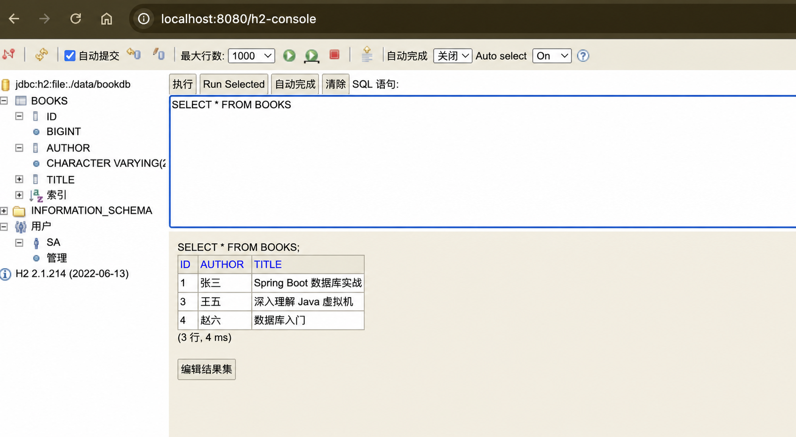

# 第 12 步：使用 H2 数据库和 Spring Data JPA

## 这一节要完成什么

上一节虽然完成了 Controller、Service、Repository 分层，但 Repository 内部仍然使用：

```java
private final List<Book> books = new ArrayList<>();
```

数据只存在于 Java 进程的内存中。应用停止后，List 消失；重新启动时，只能再次创建三本初始图书。

本节把数据保存到 H2 文件数据库：

```text
BookController
       ↓
BookService
       ↓
BookRepository（Spring Data JPA 接口）
       ↓
Hibernate 生成 SQL
       ↓
H2 文件数据库
```

完成后，新增、修改和删除结果在应用重启后仍然存在。

## 1. 先认识几个名字

### 数据库

数据库用于长期保存结构化数据。与 ArrayList 不同，数据库内容不会因为 Java 进程停止而自动消失。

当前使用 H2。H2 是一个可以直接嵌入 Java 应用的关系型数据库，适合学习和测试，不需要先单独安装 MySQL 服务。

### 数据表

关系型数据库使用表保存数据。本项目会创建 `books` 表：

| id | title | author |
| --- | --- | --- |
| 1 | Spring Boot 入门 | 张三 |

一行代表一本图书，一列代表一个属性。

### JPA

JPA 是 Java 的持久化规范。它定义了如何把 Java 对象映射到数据库表。

可以把“规范”理解为一套约定和接口。JPA 本身规定应该怎样使用，但需要具体实现真正执行。

### Hibernate

Hibernate 是 Spring Boot 2.7 默认使用的 JPA 实现。它会把 Java 操作转换成 SQL。

例如：

```java
bookRepository.findAll();
```

Hibernate 会执行类似：

```sql
select * from books;
```

### Spring Data JPA

Spring Data JPA 在 JPA 之上进一步简化 Repository。只要定义一个接口并继承 `JpaRepository`，Spring 就能在运行时生成实现。

因此我们不再手写查询循环和删除循环。

## 2. H2 内存模式和文件模式

H2 支持不同运行方式。

内存模式示例：

```text
jdbc:h2:mem:bookdb
```

应用停止后数据消失，适合自动化测试。

本课程使用文件模式：

```text
jdbc:h2:file:./data/bookdb
```

数据写入项目目录下的文件：

```text
data/bookdb.mv.db
```

因此重启应用后可以继续读取。

`data/` 已加入 `.gitignore`。数据库文件属于每个学习者的本地运行数据，不应该提交到 Git。

## 3. 停止旧程序

如果项目还在运行，请在 IDEA 底部 Run 窗口点击红色方块停止。

本节会添加依赖、实体注解和数据库配置，必须重新加载 Maven 并重新启动应用。

## 4. 在 pom.xml 添加 JPA 和 H2

打开根目录的 `pom.xml`，在 `spring-boot-starter-web` 后增加：

```xml
<dependency>
    <groupId>org.springframework.boot</groupId>
    <artifactId>spring-boot-starter-data-jpa</artifactId>
</dependency>

<dependency>
    <groupId>com.h2database</groupId>
    <artifactId>h2</artifactId>
    <scope>runtime</scope>
</dependency>
```

### spring-boot-starter-data-jpa

这个 Starter 会引入本节需要的主要组件：

- Spring Data JPA
- Hibernate
- Spring JDBC
- 数据库连接池
- 事务支持

Starter 可以理解为一组配合好的依赖集合。

### h2

```xml
<artifactId>h2</artifactId>
```

引入 H2 数据库驱动和数据库引擎。

### runtime

```xml
<scope>runtime</scope>
```

表示项目运行时需要 H2，但编译业务代码时通常不直接调用 H2 的类。

### 为什么没有手写版本号

父项目是：

```xml
<parent>
    <groupId>org.springframework.boot</groupId>
    <artifactId>spring-boot-starter-parent</artifactId>
    <version>2.7.18</version>
</parent>
```

Spring Boot 统一管理与 2.7.18 兼容的依赖版本，所以这两个 dependency 不需要再写版本号。

## 5. 在 IDEA 中重新加载 Maven

修改 `pom.xml` 后：

1. IDEA 右上角可能出现 Maven 变更提示。
2. 点击 **Load Maven Changes**。
3. 也可以打开右侧 Maven 窗口。
4. 点击刷新图标。
5. 等待底部下载进度结束。

第一次使用 JPA 和 H2 时，需要下载新的 jar。下载完成后，`javax.persistence`、`JpaRepository` 等 import 才不会显示红色。

本课程不会修改本机全局 Maven settings，依赖下载继续使用你当前 Maven 环境中的配置。

## 6. 把 Book 标记为数据库实体

打开：

```text
src/main/java/com/example/bookapi/model/Book.java
```

增加 import：

```java
import javax.persistence.Entity;
import javax.persistence.GeneratedValue;
import javax.persistence.GenerationType;
import javax.persistence.Id;
import javax.persistence.Table;
```

在类上增加：

```java
@Entity
@Table(name = "books")
public class Book {
```

在 `id` 字段上增加：

```java
@Id
@GeneratedValue(strategy = GenerationType.IDENTITY)
private Long id;
```

### @Entity

```java
@Entity
```

告诉 JPA：`Book` 是一个需要保存到数据库的实体类。

Hibernate 启动时会扫描实体，并根据字段建立表结构。

### @Table

```java
@Table(name = "books")
```

明确指定数据库表名为 `books`。

如果不写，Hibernate 会根据类名推导表名。课程中明确写出可以更直观地看到 Java 类与数据库表的对应关系。

### @Id

```java
@Id
```

表示 `id` 是数据库主键。

主键用于唯一识别每一行数据，不能有两本图书使用相同主键。

### @GeneratedValue

```java
@GeneratedValue(strategy = GenerationType.IDENTITY)
```

表示主键由数据库自动生成。

新增图书时客户端不需要发送 id，Service 会保证 id 是 null，插入后 H2 自动生成下一个编号。

### 为什么使用 javax.persistence

本项目固定使用 Spring Boot 2.7.18 和 Java 8，对应的 JPA API 包名是：

```text
javax.persistence
```

较新的 Spring Boot 3 教程通常使用 `jakarta.persistence`，并且要求更高版本的 Java。不要直接把 Spring Boot 3 教程中的 import 复制到当前 Java 8 项目。

### 为什么仍然需要无参数构造方法

```java
public Book() {
}
```

Jackson 从 JSON 创建对象需要它，JPA 创建实体对象时也需要无参数构造方法，因此必须保留。

## 7. 修改 BookRepository

原来的 `BookRepository` 是手写类，内部包含 ArrayList 和多个方法。

现在把完整文件改为：

```java
package com.example.bookapi.repository;

import com.example.bookapi.model.Book;
import org.springframework.data.jpa.repository.JpaRepository;

public interface BookRepository extends JpaRepository<Book, Long> {
}
```

### class 变成 interface

```java
public interface BookRepository
```

接口只描述可以进行哪些操作，不直接保存数据。

这个文件中没有 `new ArrayList<>()`，因为数据已经交给 H2。

### extends JpaRepository

```java
extends JpaRepository<Book, Long>
```

两个泛型参数分别表示：

- `Book`：这个 Repository 管理的实体类型。
- `Long`：Book 主键的 Java 类型。

### 空接口为什么拥有 findAll 方法

这里首先是普通的 Java 接口继承，并不是 JPA 特有语法。

例如：

```java
public interface Parent {
    void hello();
}

public interface Child extends Parent {
}
```

虽然 `Child` 的大括号是空的，但 `Child` 仍然继承了 `Parent` 的 `hello()` 方法。因此，类型为 `Child` 的变量可以调用：

```java
child.hello();
```

项目中的关系完全相同：

```text
BookRepository
      ↓ extends
JpaRepository<Book, Long>
      ↓ 已声明通用方法
findAll、findById、save、deleteById、existsById、count……
```

所以：

```java
bookRepository.findAll();
```

不是调用 `BookRepository.java` 大括号中编写的方法，而是调用它从父接口继承的方法。

### findAll 到底声明在哪里

在当前使用的 Spring Data JPA 版本中，`JpaRepository` 自己声明了类似下面的方法：

```java
List<T> findAll();
```

`JpaRepository` 还继承了其他父接口。简化后的继承关系是：

```text
BookRepository
          ↓
JpaRepository<Book, Long>
          ↓
PagingAndSortingRepository<Book, Long>
          ↓
CrudRepository<Book, Long>
```

这些接口共同提供了查询、分页、保存、删除和计数等方法。因此，一个接口不仅拥有自己直接声明的方法，也拥有父接口以及更上层父接口的方法。

### Book 和 Long 怎样替换泛型

`JpaRepository` 是通用接口，不能提前知道以后要管理的是图书、用户还是订单，所以使用 `T` 和 `ID` 作为类型占位符。可以把它的部分定义简化理解为：

```java
public interface JpaRepository<T, ID> {
    List<T> findAll();
    Optional<T> findById(ID id);
    T save(T entity);
    void deleteById(ID id);
}
```

项目写的是：

```java
JpaRepository<Book, Long>
```

这相当于告诉 Java 和 Spring：

```text
T  替换成 Book
ID 替换成 Long
```

替换后，可以把继承到的方法理解为：

```java
List<Book> findAll();
Optional<Book> findById(Long id);
Book save(Book book);
void deleteById(Long id);
```

这些代码是为了帮助理解泛型替换，不需要复制到 `BookRepository` 中。真正的方法声明已经存在于 Spring Data 提供的接口里。

继承后自动获得常用方法：

| 方法 | 作用 |
| --- | --- |
| `findAll()` | 查询全部 |
| `findById(id)` | 根据主键查询 |
| `save(book)` | 新增或修改 |
| `deleteById(id)` | 根据主键删除 |
| `existsById(id)` | 判断是否存在 |
| `count()` | 查询总数量 |

### 为什么没有实现类也能运行

项目中没有：

```java
class BookRepositoryImpl
```

Spring Data JPA 会在应用启动时读取这个接口，然后动态创建实现对象，并把它注册为 Spring Bean。

所以 Service 仍然可以通过构造器注入 `BookRepository`。

这里需要区分两个时间点。

编译代码时，Java 只需要确认 `BookRepository` 继承了 `findAll()`，所以这一行可以通过编译：

```java
bookRepository.findAll();
```

运行项目时，只有接口还不够，因为真正执行查询必须有实现。Spring Data JPA 会完成以下工作：

```text
Spring Boot 启动
      ↓
扫描到 BookRepository 接口
      ↓
读取 Book 和 Long 两个泛型信息
      ↓
创建一个实现 BookRepository 的代理对象
      ↓
代理对象把通用增删改查交给 SimpleJpaRepository
      ↓
把代理对象注册成 Spring Bean
      ↓
通过 BookService 构造方法注入
```

`SimpleJpaRepository` 是 Spring Data JPA 提供的通用实现类。Spring 创建的代理对象会把 `findAll()` 等调用交给它处理。这里的“动态创建”不表示项目中生成了一个可见的 `BookRepositoryImpl.java` 文件；这个对象是在程序运行期间存在于内存中的。

### findAll 从 Java 方法到 SQL 的完整过程

当 Service 执行：

```java
return bookRepository.findAll();
```

完整过程可以理解为：

```text
BookService 调用 findAll()
      ↓
Spring 创建的 Repository 代理对象接收调用
      ↓
SimpleJpaRepository 执行通用 findAll 逻辑
      ↓
通过 JPA 的 EntityManager 发起实体查询
      ↓
Hibernate 根据 @Entity 和 @Table 生成 SQL
      ↓
H2 执行类似 SELECT ... FROM books 的 SQL
      ↓
Hibernate 把每一行转换成 Book 对象
      ↓
多个 Book 组成 List<Book>
      ↓
结果返回给 BookService
```

`SimpleJpaRepository` 内部的实际代码更复杂，但核心意思可以简化为：

```text
findAll()
    → 使用 EntityManager 创建 Book 实体查询
    → 执行查询
    → 返回结果列表
```

这段是原理流程，不是需要复制的项目代码。真正的 Java 实现由 Spring Data JPA 依赖包提供。

因此，不是 `findAll()` 天然认识 `books` 表，而是下面的信息共同确定了查询目标：

```java
JpaRepository<Book, Long>  // 要查询 Book
@Entity                    // Book 是数据库实体
@Table(name = "books")     // Book 对应 books 表
```

### 在 IDEA 中亲自找到 findAll

1. 打开 `BookRepository.java`。
2. 按住 `Command`，点击 `JpaRepository`。
3. IDEA 会打开 Maven 依赖中的接口源码。
4. 在打开的文件中搜索 `findAll`。
5. 也可以回到 `BookService`，按住 `Command` 点击 `findAll()`，查看 IDEA 跳转到的方法声明。

如果 IDEA 显示的是只读源码，这是正常的。它来自 Maven 下载的 Spring Data JPA 依赖，不属于当前项目，不需要修改。

### JPA、Hibernate、Spring Data JPA 各自负责什么

这三个名称不是同一个东西：

| 名称 | 在这里的职责 |
| --- | --- |
| JPA | 规定实体映射和数据库操作的标准接口 |
| Hibernate | 实现 JPA，并把实体操作转换成 SQL |
| Spring Data JPA | 提供 `JpaRepository`，自动创建 Repository 代理并封装通用增删改查 |

所以 `JpaRepository` 是 **Spring Data JPA** 提供的接口，而不是 JDK 自带的接口，也不是 H2 提供的接口。

### 怎样判断一个 Repository 方法来自哪里

以后看到 Repository 方法时，可以先分成下面四类：

| 类型 | 示例 | 谁声明方法 | 谁完成实现 |
| --- | --- | --- | --- |
| 继承的通用方法 | `findAll()`、`findById()`、`save()`、`deleteById()` | Spring Data 的父接口 | Spring Data JPA 的通用实现 |
| 按名称派生的查询 | `findByAuthor(String author)` | 当前项目的 `BookRepository` | Spring 根据方法名自动生成查询 |
| 使用 `@Query` 的查询 | `findBooksByTitle(...)` | 当前项目的 `BookRepository` | Spring 执行注解中写明的 JPQL 或 SQL |
| 完全手写的实现 | 复杂的特殊数据库操作 | 当前项目的接口或类 | 当前项目自己编写实现代码 |

当前项目中的 `BookRepository` 是空接口：

```java
public interface BookRepository extends JpaRepository<Book, Long> {
}
```

因此，本节使用的 Repository 方法全部是继承来的通用方法：

```java
bookRepository.findAll();
bookRepository.findById(id);
bookRepository.save(book);
bookRepository.existsById(id);
bookRepository.deleteById(id);
bookRepository.count();
```

判断依据不是“方法看起来像不像内置方法”，而是查看方法声明的位置：

- `BookRepository` 中没写，父接口中能找到：继承的方法。
- `BookRepository` 中亲自声明：项目自定义的方法。
- 方法上有 `@Query`：项目明确提供了查询语句。

### 自定义方法为什么也可能没有实现类

例如，以后可以在 `BookRepository` 的大括号中声明：

```java
List<Book> findByAuthor(String author);
```

这个方法签名是项目自己定义的，所以它属于“自定义 Repository 方法”。但是我们仍然没有编写方法体。

Spring Data JPA 能按照固定命名规则拆解方法名：

```text
find  By  Author
查询  根据  author 字段
```

然后自动生成类似下面的查询：

```sql
SELECT * FROM books WHERE author = ?;
```

这里要区分两个概念：

- **方法声明是不是我们写的**：`findByAuthor` 是我们写的。
- **方法实现是不是我们写的**：不是，查询实现仍由 Spring Data JPA 生成。

课程当前没有真正加入 `findByAuthor`，上面的代码只用于解释方法来源，暂时不需要复制到项目中。

### 使用 @Query 的自定义查询

如果方法名称无法清楚表达查询，也可以明确写出查询规则。例如：

```java
@Query("select book from Book book where book.title = :title")
List<Book> findBooksByTitle(@Param("title") String title);
```

此时：

- 方法名 `findBooksByTitle` 由项目定义。
- `@Query` 中的查询也由项目定义。
- Spring Data JPA 仍负责创建代理对象和执行查询。

这里的 `Book` 是实体类名，不是数据库表名；这种面向实体编写的查询叫 JPQL。`@Query` 会在后续需要自定义查询时再正式练习，本节只需要认识它与 `findAll()` 的来源不同。

### Repository 代理怎样决定执行方式

不管调用的是继承方法还是自定义查询，代理对象都会先判断这个方法该交给谁执行：

```text
BookService 调用 BookRepository 的方法
      ↓
Spring 创建的 Repository 代理对象拦截调用
      ↓
确定执行方式
  ├─ findAll 等继承方法 → SimpleJpaRepository
  ├─ findByAuthor 等名称查询 → 解析方法名称
  └─ @Query 方法 → 读取注解中的查询
      ↓
通过 JPA EntityManager 执行实体操作
```

从 HTTP 请求一直到 H2 的完整链路，本节第 19 步会按启动阶段和请求阶段完整串一遍。

### 当前六个通用方法分别怎样执行

#### findAll

```text
findAll()
  → 查询所有 Book
  → Hibernate 生成 SELECT
  → H2 返回 books 表的全部行
  → 转换成 List<Book>
```

#### findById

```text
findById(1L)
  → 使用 Book 的主键查询
  → Hibernate 生成带 id 条件的 SELECT
  → 有结果时得到 Optional<Book>
  → 没有结果时得到 Optional.empty()
```

#### save

```text
save(book)
  → Spring Data 判断 Book 是否是新实体
  → id 为 null 时按照新增处理
  → Hibernate 生成 INSERT
  → H2 生成主键并写回 Book.id
```

对于已经存在的实体，`save()` 会走保存修改的逻辑，并在合适的时机产生 `UPDATE`。所以同一个 `save()` 可以用于新增和修改，本项目的 `create()` 才要先执行 `book.setId(null)`，确保新增接口不会意外覆盖已有数据。

#### existsById

```text
existsById(id)
  → 查询这个主键是否存在
  → 返回 boolean
  → 只会得到 true 或 false
```

#### deleteById

```text
deleteById(id)
  → 根据主键定位实体
  → Hibernate 生成 DELETE
  → H2 删除对应数据行
```

#### count

```text
count()
  → Hibernate 生成 COUNT 查询
  → H2 返回总行数
  → Java 得到 long 类型的数量
```

`DataInitializer` 正是先调用 `count()`。只有结果为 0，才执行三次 `save()` 插入初始数据，所以重启应用不会重复添加图书。

### 在 IDEA 中判断方法来源

以后遇到不认识的方法，可以按下面步骤检查：

1. 在调用位置按住 `Command` 并点击方法名。
2. 查看 IDEA 跳转到了哪个接口或类。
3. 如果跳到 `JpaRepository`、`CrudRepository` 等依赖源码，它是继承的通用方法。
4. 如果跳回当前项目的 `BookRepository`，它是项目声明的方法。
5. 如果方法上有 `@Query`，继续阅读注解中的查询。
6. 还可以把光标放在方法上按 `Control + J`，查看快速文档和返回类型。

IDEA 跳转到 Maven 依赖的只读源码是正常现象。阅读它可以确认方法来源，但不要修改依赖源码。

### 为什么不再写 @Repository

继承 `JpaRepository` 后，Spring Data 会自动识别这个接口并创建 Bean，不要求在接口上额外添加 `@Repository`。

## 8. 修改 BookService

### findById 返回 Optional

JpaRepository 的 `findById` 返回：

```java
Optional<Book>
```

Optional 表示“里面可能有一本 Book，也可能没有”。

为了暂时保持现有 Controller 行为，本节写成：

```java
public Book findById(Long id) {
    return bookRepository.findById(id).orElse(null);
}
```

`orElse(null)` 的含义：

- 查询到图书：返回 Book。
- 没查询到：返回 null。

后面的统一异常处理课程会把“返回 null”改成规范的 HTTP 404。

### create 时清空客户端 id

```java
public Book create(Book book) {
    book.setId(null);
    return bookRepository.save(book);
}
```

JPA 的 `save()` 会根据 id 判断新增还是修改。创建接口应该始终新增，所以先把客户端可能传入的 id 设置为 null，让数据库生成主键。

### update 查找并保存

```java
public Book update(Long id, Book updatedBook) {
    Book book = bookRepository.findById(id).orElse(null);
    if (book == null) {
        return null;
    }
    book.setTitle(updatedBook.getTitle());
    book.setAuthor(updatedBook.getAuthor());
    return bookRepository.save(book);
}
```

运行步骤：

```text
根据 URL id 查询数据库
          ↓
不存在就返回 null
          ↓
存在就修改实体字段
          ↓
调用 save 把修改写回数据库
```

### delete 先判断是否存在

```java
public void delete(Long id) {
    if (bookRepository.existsById(id)) {
        bookRepository.deleteById(id);
    }
}
```

这样重复删除同一个编号仍然返回 204，不会因为记录已经不存在而抛出异常，保持上一节的接口行为。

## 9. 创建数据库配置文件

在 IDEA 中：

1. 右键 `src/main`。
2. 选择 **New → Directory**。
3. 输入 `resources`。
4. 右键 `resources`。
5. 选择 **New → File**。
6. 输入 `application.properties`。

文件路径：

```text
src/main/resources/application.properties
```

完整内容：

```properties
spring.datasource.url=jdbc:h2:file:./data/bookdb
spring.datasource.driver-class-name=org.h2.Driver
spring.datasource.username=sa
spring.datasource.password=

spring.jpa.hibernate.ddl-auto=update
spring.jpa.show-sql=true
spring.jpa.properties.hibernate.format_sql=true
spring.jpa.open-in-view=false

spring.h2.console.enabled=true
spring.h2.console.path=/h2-console
```

### 数据库地址

```properties
spring.datasource.url=jdbc:h2:file:./data/bookdb
```

- `jdbc:h2:`：使用 H2 JDBC 驱动。
- `file:`：使用文件数据库，而不是内存数据库。
- `./data/bookdb`：相对于项目运行目录保存数据库。

H2 实际会创建类似：

```text
data/bookdb.mv.db
```

### 驱动类

```properties
spring.datasource.driver-class-name=org.h2.Driver
```

指定负责连接 H2 的 JDBC 驱动。

### 用户名和密码

```properties
spring.datasource.username=sa
spring.datasource.password=
```

学习项目使用 H2 默认用户 `sa`，密码为空。

这只适用于本地学习环境，真实生产数据库必须设置安全凭据，并避免把密码直接提交到 Git。

### ddl-auto=update

```properties
spring.jpa.hibernate.ddl-auto=update
```

Hibernate 根据实体结构创建或更新数据表。

学习项目使用 `update` 可以减少手动建表步骤。生产项目通常使用 Flyway 或 Liquibase 管理数据库版本，不能把 `ddl-auto=update` 当作正式数据库升级方案。

### 显示 SQL

```properties
spring.jpa.show-sql=true
spring.jpa.properties.hibernate.format_sql=true
```

让控制台显示 Hibernate 执行的 SQL，并进行格式化，帮助观察 JPA 方法最终变成了什么 SQL。

### open-in-view=false

```properties
spring.jpa.open-in-view=false
```

本项目是 REST API，数据访问应该在 Service/Repository 调用过程中完成。显式关闭 Open EntityManager in View，也可以避免启动时出现默认开启的提示。

### H2 Console

```properties
spring.h2.console.enabled=true
spring.h2.console.path=/h2-console
```

开启浏览器数据库管理页面，地址是：

```text
http://localhost:8080/h2-console
```

它只用于本地学习，生产环境通常不应该开放。

## 10. 创建 DataInitializer

如果数据库第一次启动时完全为空，需要插入三本初始图书。

在 IDEA 中：

1. 右键 `com.example.bookapi`。
2. 选择 **New → Package**。
3. 输入 `config`。
4. 右键 `config` 包。
5. 选择 **New → Java Class**。
6. 输入 `DataInitializer`。

完整代码：

```java
package com.example.bookapi.config;

import com.example.bookapi.model.Book;
import com.example.bookapi.repository.BookRepository;
import org.springframework.boot.CommandLineRunner;
import org.springframework.stereotype.Component;

@Component
public class DataInitializer implements CommandLineRunner {

    private final BookRepository bookRepository;

    public DataInitializer(BookRepository bookRepository) {
        this.bookRepository = bookRepository;
    }

    @Override
    public void run(String... args) {
        if (bookRepository.count() == 0) {
            bookRepository.save(new Book(null, "Spring Boot 入门", "张三"));
            bookRepository.save(new Book(null, "Java 核心技术", "李四"));
            bookRepository.save(new Book(null, "深入理解 Java 虚拟机", "王五"));
        }
    }
}
```

### @Component

```java
@Component
```

让 Spring 创建并管理 DataInitializer。

### CommandLineRunner

```java
implements CommandLineRunner
```

表示应用启动完成 Spring Bean 创建后，要运行这个类的 `run()` 方法。

### 谁调用了 run()

这里最容易困惑的一点是：项目中没有任何一行代码写过 `dataInitializer.run(...)`。

`run()` 是 Spring Boot 在启动流程的最后一步主动回调的。完整过程如下：

```text
main(args)
      ↓
SpringApplication.run(BookApiApplication.class, args)
      ↓
@SpringBootApplication 中的 @ComponentScan 从 com.example.bookapi 向下扫描
      ↓
发现 config.DataInitializer 上有 @Component，注册成 Bean 定义
      ↓
创建容器中的单例 Bean
  ├─ HikariCP 连接池和 Hibernate EntityManagerFactory 就绪
  ├─ Hibernate 按 ddl-auto=update 建好 books 表
  ├─ Spring Data JPA 创建 BookRepository 代理对象
  ├─ 执行 new DataInitializer(bookRepository) 完成构造器注入
  └─ Tomcat 开始监听 8080 端口
      ↓
日志打印 Started BookApiApplication in x.x seconds
      ↓
SpringApplication 调用内部的 callRunners 方法
      ↓
从容器中取出所有 CommandLineRunner 和 ApplicationRunner Bean
      ↓
逐个回调它们的 run(args)
      ↓
DataInitializer.run() 被执行 → count() → 为 0 才 save() 三次
```

所以 `implements CommandLineRunner` 的作用是“打标记”：

| 写法 | 作用 |
| --- | --- |
| `@Component` | 让 DataInitializer 进入 Spring 容器 |
| `implements CommandLineRunner` | 让 Spring Boot 在启动收尾阶段回调它的 `run()` |

两者缺少任何一个，`run()` 都不会执行。

### 关于 CommandLineRunner 的几个细节

- 执行时机在所有 Bean 创建完成、Hibernate 建表完成、Tomcat 已经启动之后。因此 `run()` 里可以直接使用 `bookRepository`，`books` 表也已经存在。
- 控制台的顺序是 `Started BookApiApplication ...` 先出现，之后才是 `select count(*)` 和三条 `insert into books`。因为打印启动完成日志发生在回调 Runner 之前。
- `run(String... args)` 收到的就是 `main` 方法的原始命令行参数。
- 它还有一个兄弟接口 `ApplicationRunner`，区别只是回调参数变成解析过的 `ApplicationArguments`。两者由同一段启动逻辑统一回调。
- 如果项目里有多个 Runner，可以用 `@Order` 控制先后顺序。
- `run()` 中抛出异常会导致应用启动失败并退出，不是忽略后继续运行。

想亲自确认调用来源，可以在 `bookRepository.count()` 这一行打断点，用 Debug 方式启动，然后查看调用栈。栈中会出现 Spring Boot 的 `SpringApplication` 调用 `DataInitializer.run` 的过程。

### 构造器注入

DataInitializer 通过构造方法取得 Spring Data 创建的 BookRepository，与前一节的构造器注入方式相同。

### count() == 0

```java
if (bookRepository.count() == 0)
```

先查询数据库中有多少本书，只有完全为空时才插入初始数据。

这一步非常重要。如果每次启动都无条件插入，重启一次就会多出三本重复图书。

### new Book(null, ...)

id 传入 null，让 H2 根据 `@GeneratedValue` 自动生成 1、2、3。

数据库已有任何图书时，初始化器不会覆盖或重复插入。

## 11. 将 data 目录加入 .gitignore

根目录 `.gitignore` 增加：

```gitignore
data/
```

原因：

- 数据库文件是本地运行产生的数据。
- 二进制数据库文件不适合用 Git 查看差异。
- 每位学习者应该拥有自己的数据库内容。
- 课程源码通过 DataInitializer 创建初始数据，不需要提交数据库文件。

## 12. 启动时应该观察什么

运行 `BookApiApplication`，第一次启动时控制台会出现类似信息：

```text
Found 1 JPA repository interfaces
Tomcat initialized with port(s): 8080 (http)
HikariPool-1 - Start completed.
H2 console available at '/h2-console'. Database available at 'jdbc:h2:file:./data/bookdb'
Using dialect: org.hibernate.dialect.H2Dialect
create table books
Tomcat started on port(s): 8080 (http)
```

在 `Started BookApiApplication in x.x seconds` 之后，还会看到一条 `select count(*)` 和三条 `insert into books`，这是 DataInitializer 插入初始数据。

以后重启时同样先执行 `select count(*)`。因为数据库不为空，不会重复执行三条初始 insert。

完整的启动顺序和它与请求处理的衔接关系，见本节第 19 步。

## 13. 验证接口仍然正常

应用启动后执行：

```bash
curl -i http://localhost:8080/api/books
```

第一次应该看到三本初始图书。

新增一本需要跨重启验证的图书：

```bash
curl -i -X POST http://localhost:8080/api/books -H 'Content-Type: application/json' -d '{"title":"数据库入门","author":"赵六"}'
```

预期返回 HTTP 201 和数据库生成的编号，第一次通常是 4：

```json
{"id":4,"title":"数据库入门","author":"赵六"}
```

## 14. 验证数据重启后仍然存在

这是本节最重要的验证。

1. 确认 POST 已经新增《数据库入门》。
2. 在 IDEA Run 窗口点击红色方块停止应用。
3. 再次运行 `BookApiApplication`。
4. 等待出现 `Started BookApiApplication`。
5. 再次查询：

```bash
curl -i http://localhost:8080/api/books
```

如果重启后仍能看到《数据库入门》，说明数据来自 H2 文件，而不是 Java 内存 List。

## 15. 验证修改和删除也能持久化

修改编号 1：

```bash
curl -i -X PUT http://localhost:8080/api/books/1 -H 'Content-Type: application/json' -d '{"title":"Spring Boot 数据库实战","author":"张三"}'
```

删除编号 2：

```bash
curl -i -X DELETE http://localhost:8080/api/books/2
```

再次停止并重启应用，然后查询全部图书。预期：

- 编号 1 的新书名仍然存在。
- 编号 2 仍然不存在。
- 新增的《数据库入门》仍然存在。

## 16. 使用 H2 Console 查看数据

保持应用运行，浏览器访问：

```text
http://localhost:8080/h2-console
```

登录信息：

| 字段 | 内容 |
| --- | --- |
| Driver Class | `org.h2.Driver` |
| JDBC URL | `jdbc:h2:file:./data/bookdb` |
| User Name | `sa` |
| Password | 留空 |

点击 **Connect**。

进入后执行：

```sql
SELECT * FROM BOOKS;
```

点击 **Run**，可以直接看到数据库表中的图书。

H2 Console 是辅助学习工具。接口验证仍以 curl 和浏览器返回结果为准。

### 本节实际验证结果

本节已经按顺序完成以下操作：

1. GET 查询到三本初始图书。
2. POST 新增《数据库入门》，H2 自动生成编号 4。
3. PUT 把编号 1 修改为《Spring Boot 数据库实战》。
4. DELETE 删除编号 2，接口返回 HTTP 204。
5. 再次查询时，只剩编号 1、3、4，内容与修改结果一致。
6. 停止并重新启动应用后，启动日志显示 Spring 找到 1 个 JPA Repository，并连接到 `jdbc:h2:file:./data/bookdb`。
7. 重启时 Hibernate 只执行 `select count(*)`，没有再次插入三本初始图书。
8. 在 H2 Console 中执行 `SELECT * FROM BOOKS;`，数据库表中的三行数据与接口返回一致。

这同时证明：Controller 到数据库的完整调用链能够工作，并且新增、修改、删除结果已经保存到 H2 文件，而不是只存在于 Java 内存中。



> 截图用于培训文档前已移除浏览器会话参数和个人水印。H2 Console 只建议在本地学习环境中开启。

## 17. 如何重置本地学习数据库

如果以后需要从空数据库重新练习：

1. 先停止 Spring Boot 应用。
2. 在 Finder 或 IDEA 中找到项目根目录下的 `data` 文件夹。
3. 建议先把它重命名为 `data-backup` 作为备份。
4. 再次启动项目。

因为找不到原数据库文件，H2 会创建新数据库，DataInitializer 会重新插入三本初始图书。

不要在应用运行时移动数据库文件。

## 18. 当前项目目录

```text
spring-boot-project
├── data/                         本地 H2 数据，不提交
├── pom.xml                       JPA 和 H2 依赖
└── src
    ├── main
    │   ├── java/com/example/bookapi
    │   │   ├── config
    │   │   │   └── DataInitializer.java
    │   │   ├── controller
    │   │   │   └── BookController.java
    │   │   ├── model
    │   │   │   └── Book.java
    │   │   ├── repository
    │   │   │   └── BookRepository.java
    │   │   └── service
    │   │       └── BookService.java
    │   └── resources
    │       └── application.properties
    └── test/resources
        └── application.properties   测试专用的内存 H2 配置
```

测试配置使用 `jdbc:h2:mem:bookdb-test`，不会连接正式运行时的 `data/bookdb`。因此，即使 IDEA 中的应用还在运行，执行 `mvn test` 也不会争抢同一个数据库文件，更不会修改手动练习得到的数据。URL 后面的 `DB_CLOSE_DELAY=-1` 让测试期间的数据库保持可用，`DB_CLOSE_ON_EXIT=FALSE` 则让 Spring 和 Hibernate 按正常顺序关闭它。

## 19. 完整调用链路

前面各步分别解释了实体、Repository、配置和初始化器。这一步把它们按时间顺序串成一条链路。

关键是先区分两个阶段：

| 阶段 | 发生次数 | 主要工作 |
| --- | --- | --- |
| 启动阶段 | 每次运行应用一次 | 创建 Bean、建表、插入初始数据 |
| 请求阶段 | 每来一个 HTTP 请求一次 | 查询或修改数据并返回 JSON |

初学时容易把两个阶段混在一起，于是会产生“表是谁建的”“三本书是谁插入的”“findAll 的实现什么时候出现”这类疑问。它们全部发生在启动阶段，请求阶段只是使用已经准备好的对象。

### 阶段一：启动阶段（只执行一次）

```text
1. main() 调用 SpringApplication.run(BookApiApplication.class, args)
      ↓
2. 读取 src/main/resources/application.properties
   日志：Starting BookApiApplication using Java 1.8...
      ↓
3. @ComponentScan 从 com.example.bookapi 向下扫描
   登记 BookController(@RestController)、BookService(@Service)、DataInitializer(@Component)
      ↓
4. Spring Data 扫描 Repository 接口
   日志：Found 1 JPA repository interfaces
   这一步只登记 BookRepository，代理对象还没有真正创建
      ↓
5. 准备内嵌 Tomcat
   日志：Tomcat initialized with port(s): 8080 (http)
      ↓
6. 创建容器中的单例 Bean
   创建 BookRepository 代理需要数据源和 JPA，于是先完成下面这些：
   ├─ HikariCP 按 spring.datasource.url 建立连接池
   │  日志：HikariPool-1 - Start completed
   ├─ 注册 H2 Console
   │  日志：H2 console available at '/h2-console'
   ├─ Hibernate 扫描 @Entity，选定 H2Dialect
   ├─ 按 ddl-auto=update 对比实体和数据库，第一次启动时执行 create table books
   └─ 日志：Initialized JPA EntityManagerFactory for persistence unit 'default'
      ↓
7. BookRepository 代理创建完成，通用方法交给 SimpleJpaRepository
      ↓
8. 按依赖顺序完成注入
   BookRepository 代理 → BookService → BookController
   BookRepository 代理 → DataInitializer
      ↓
9. Tomcat 真正开始监听，DispatcherServlet 登记 /api/books 等地址与 Controller 方法的对应关系
   日志：Tomcat started on port(s): 8080 (http)
      ↓
10. 日志：Started BookApiApplication in x.x seconds
      ↓
11. Spring Boot 回调所有 CommandLineRunner
    DataInitializer.run() 执行 count()，日志出现 select count(*)
    结果为 0 时 save() 三次，出现三条 insert into books
      ↓
12. 应用就绪，等待 HTTP 请求
```

到这里，后面请求要用到的东西已经全部准备好：连接池、`books` 表、Repository 代理、Service、Controller、地址映射。

两个容易看错的地方：

- 启动阶段第 4 步的 `Found 1 JPA repository interfaces` 出现得很早，它表示“扫描到了这个接口”，不表示代理对象已经可用。代理对象要等到第 6、7 步，也就是 EntityManagerFactory 就绪之后才创建。
- Tomcat 的日志分两条。`Tomcat initialized` 在前，只是初始化；真正开始接收请求是靠后的 `Tomcat started`。所以在数据库和 Bean 都没准备好之前，端口不会对外提供服务。

### 阶段二：请求阶段（每次请求都会走一遍）

以 `curl -i http://localhost:8080/api/books` 为例：

```text
1. curl 发出 GET /api/books
      ↓
2. Tomcat 接收连接，交给 DispatcherServlet
      ↓
3. DispatcherServlet 按启动阶段登记的映射，找到 BookController.findAll()
      ↓
4. Controller 调用 bookService.findAll()
      ↓
5. Service 调用 bookRepository.findAll()
   这里的 bookRepository 就是启动阶段第 6 步创建的代理对象
      ↓
6. 代理对象判断 findAll 属于继承的通用方法，交给 SimpleJpaRepository
      ↓
7. SimpleJpaRepository 通过 EntityManager 发起 Book 实体查询
      ↓
8. Hibernate 根据 @Entity 和 @Table 生成 select ... from books
      ↓
9. 从 HikariCP 借一个连接，H2 执行 SQL 并返回数据行
      ↓
10. Hibernate 把每一行转换成 Book 对象，组成 List<Book>
      ↓
11. 结果沿 Repository → Service → Controller 原路返回
      ↓
12. @RestController 让 Jackson 把 List<Book> 转换成 JSON
      ↓
13. Tomcat 返回 HTTP 200 和 JSON 响应体
```

### 每一层负责什么

| 层次 | 主要职责 |
| --- | --- |
| Tomcat | 接收和返回 HTTP 请求 |
| DispatcherServlet | 按地址和请求方法找到对应的 Controller 方法 |
| Controller | 处理地址、参数、JSON 和响应状态 |
| Service | 组织业务步骤，例如先查询再修改 |
| Repository | 表达需要进行的数据库操作 |
| Repository 代理 | 接收接口调用并选择对应实现方式 |
| EntityManager | JPA 操作实体的核心接口 |
| Hibernate | 实现 JPA，生成并执行 SQL |
| HikariCP | 管理可复用的数据库连接 |
| H2 | 真正保存表和数据 |

### 新增请求的差异

四个接口走的是同一条链路，只有第 4 到第 10 步的内容不同。以 POST 为例：

```text
POST /api/books + JSON
      ↓
Jackson 用无参构造方法创建 Book 并填入 title、author，id 为 null
      ↓
BookController.create() 调用 bookService.create(book)
      ↓
Service 再次执行 book.setId(null)，确保是新增
      ↓
bookRepository.save(book)
      ↓
代理对象 → SimpleJpaRepository 判断 id 为 null，按新增处理
      ↓
Hibernate 生成 insert into books
      ↓
H2 插入一行并生成主键，Hibernate 把生成的 id 写回 Book
      ↓
Controller 返回带 id 的 Book，Jackson 转换成 JSON
      ↓
因为有 @ResponseStatus(HttpStatus.CREATED)，响应状态是 201
```

PUT 是先 `findById` 再 `save`，产生一条 select 和一条 update。DELETE 是先 `existsById` 再 `deleteById`，产生一条 select 和一条 delete。

### 用控制台日志对照这条链路

打开 `show-sql` 后，可以直接在 IDEA 的 Run 窗口逐行对照。下面是本项目一次真实重启的日志（数据库中已有数据），只删掉了时间戳和线程名。箭头后面的编号指的是上面启动阶段的步骤号，不是文档小节号：

```text
Starting BookApiApplication using Java 1.8.0_502 ...        ← 启动阶段第 2 步
No active profile set, falling back to 1 default profile
Bootstrapping Spring Data JPA repositories in DEFAULT mode.  ← 第 4 步开始
Finished Spring Data repository scanning in 19 ms.
        Found 1 JPA repository interfaces.                   ← 只是扫描到接口
Tomcat initialized with port(s): 8080 (http)                 ← 第 5 步，尚未监听
Root WebApplicationContext: initialization completed
HikariPool-1 - Starting...                                   ← 第 6 步，连接池
HikariPool-1 - Start completed.
H2 console available at '/h2-console'.
        Database available at 'jdbc:h2:file:./data/bookdb'    ← 确认是文件数据库
Processing PersistenceUnitInfo [name: default]
Hibernate ORM core version 5.6.15.Final
Using dialect: org.hibernate.dialect.H2Dialect
Initialized JPA EntityManagerFactory for persistence unit 'default'
Tomcat started on port(s): 8080 (http)                       ← 第 9 步，开始监听
Started BookApiApplication in 1.924 seconds                  ← 第 10 步，启动完成
Hibernate:
    select
        count(*) as col_0_0_
    from
        books book0_                                         ← 第 11 步，Runner 回调
```

这段日志同时说明三件事：

1. 最后那条 `select count(*)` 出现在 `Started BookApiApplication` 之后，它来自 `DataInitializer.run()`，不属于任何 HTTP 请求。
2. 这次 `count()` 结果不是 0，所以后面没有三条 `insert into books`，初始数据不会重复插入。
3. 因为 `ddl-auto=update` 发现 `books` 表已经存在且结构一致，这次没有 `create table books`。只有第一次启动或删掉 `data/` 之后才会看到建表语句。

执行 curl 之后，才会出现这次请求对应的 `select`、`insert`、`update` 或 `delete`，那属于请求阶段。

## 成功标准

- Maven 能加载 JPA 和 H2 依赖。
- 项目启动时 Spring 找到 1 个 JPA Repository。
- H2 创建 `books` 表。
- 第一次启动时存在三本初始图书。
- POST 新增图书时数据库自动生成 id。
- 停止并重启应用后，新增图书仍然存在。
- 修改和删除结果重启后仍然存在。
- 能解释 `@Entity`、`@Id`、`@GeneratedValue`。
- 能解释为什么 BookRepository 接口不需要手写实现类。
- 能说出 JPA、Hibernate、Spring Data JPA、H2 的大致关系。
- 能说出 DataInitializer 的 `run()` 是被谁调用的，以及它在启动流程中的位置。
- 能区分启动阶段和请求阶段各自完成了什么工作。

## 常见问题

### javax.persistence 显示红色

确认 `pom.xml` 已添加 `spring-boot-starter-data-jpa`，然后在 Maven 窗口点击刷新并等待下载完成。

本项目使用 Spring Boot 2.7，请导入 `javax.persistence`，不是 `jakarta.persistence`。

### 启动时报 Not a managed type

确认 Book 类上有 `@Entity`，并且 Book 位于 `com.example.bookapi` 子包中。

### 启动时报 No identifier specified

确认 `id` 字段上有 `@Id`。

### BookRepository 无法注入

确认接口继承写成：

```java
JpaRepository<Book, Long>
```

并确认 Repository 位于 `com.example.bookapi.repository`。

### 每次启动都出现重复初始数据

确认 DataInitializer 在保存前判断：

```java
bookRepository.count() == 0
```

### 重启后数据消失

检查数据库 URL 是否是文件模式：

```text
jdbc:h2:file:./data/bookdb
```

如果使用 `jdbc:h2:mem:...`，数据会在停止后消失。

### H2 Console 登录失败

确认 JDBC URL 与 `application.properties` 完全一致，用户名是 `sa`，密码留空，并保持应用正在运行。

### 端口 8080 被占用

可能仍有旧的 Spring Boot 进程在运行。在 IDEA Run 窗口停止旧进程，再重新启动。

### 执行测试时报 Database may be already in use

这表示正在运行的应用和测试同时连接了同一个文件型 H2 数据库。确认项目中存在：

```text
src/test/resources/application.properties
```

并确认测试数据库 URL 是：

```text
jdbc:h2:mem:bookdb-test;DB_CLOSE_DELAY=-1;DB_CLOSE_ON_EXIT=FALSE
```

`src/main/resources/application.properties` 用于正常运行，`src/test/resources/application.properties` 只在测试时覆盖同名配置。这样可以隔离运行数据和测试数据。

### 控制台出现很多 SQL

这是 `spring.jpa.show-sql=true` 的效果，目的是帮助学习 JPA。看到 select、insert、update、delete 都是正常的。
